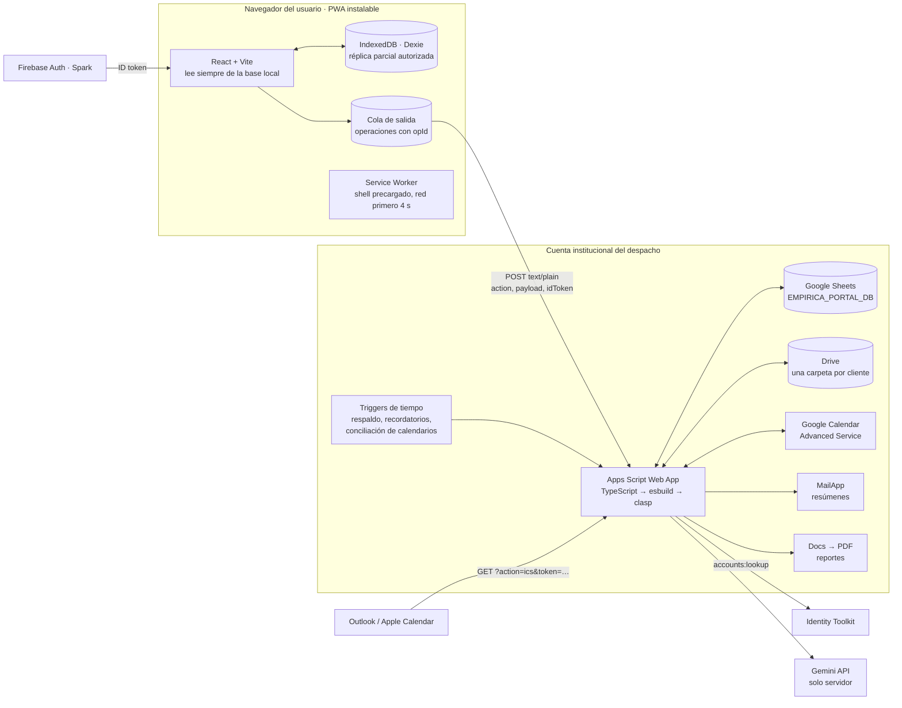
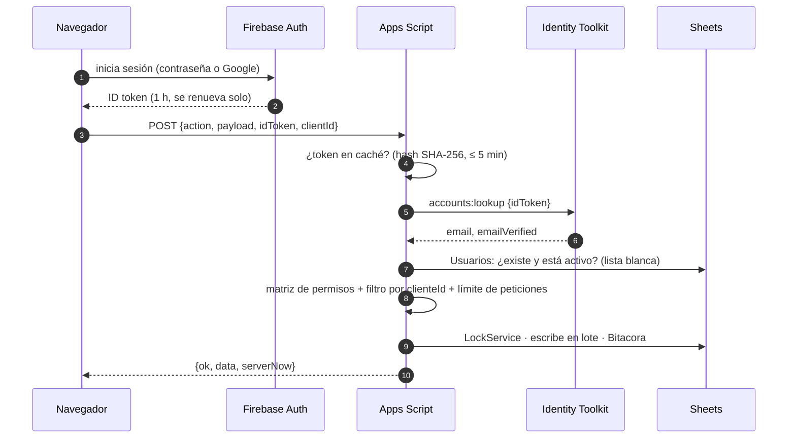
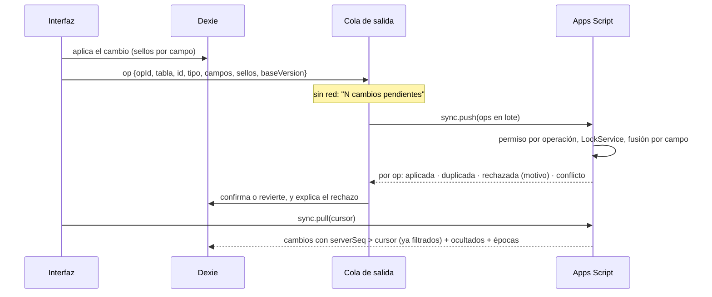

# Plan del proyecto · Empírica Portal

> **Estado: Fase 0 aprobada el 2 de octubre de 2026** (paleta y tipografía A, y respuestas a las 15 preguntas, ver la § 13). **Fase 1 (backend núcleo) aprobada el 3 de octubre de 2026** (§ 14). **Fase 2 (el portal en el navegador) aprobada el 4 de octubre de 2026** (§ 15), con el botón de sugerencias y errores que pediste al aprobarla (§ 16). **Fase 3 (asuntos, tareas, comentarios, documentos y conflictos) aprobada el 4 de octubre de 2026** (§ 17). **Fase 4 (trámites, compliance, contratos y solicitudes) aprobada el 4 de octubre de 2026** (§ 18). **Fase 5 (calendarios, avisos y correos) aprobada el 5 de octubre de 2026** (§ 19).

Documentos:

| Documento                                    | Contenido                                                                                |
| -------------------------------------------- | ---------------------------------------------------------------------------------------- |
| `PLAN.md` (este)                             | Arquitectura, modelo de datos, sincronización, contrato de la API, riesgos y decisiones  |
| `PERMISOS.md`                                | Matriz completa de permisos por rol                                                      |
| `REUSO_TSJ.md`                               | Técnicas de TSJ Filing que se reutilizan (solo técnicas: ninguna función ni dato de TSJ) |
| `LIMITES.md`                                 | Cuotas y límites verificados el 2 de octubre de 2026, con fuentes                        |
| `SEGURIDAD.md`                               | Modelo de amenazas, controles y la diferencia con el cifrado de TSJ                      |
| `IA.md`                                      | Modos de IA, términos vigentes de Gemini y modelos disponibles                           |
| `DISENO.md` y `design/paleta-propuesta.html` | Paleta, logos, tokens claro/oscuro, semáforo, gráficas, tipografía y ayudas de interfaz  |
| `SETUP.md`                                   | Cuentas y datos que hacen falta, paso a paso                                             |

---

## 1. Decisiones

| #   | Tema                                   | Decisión                                                                                                                                                                                                                                                                                                                                                                                                                                                                                                                                                                                                                                   | Por qué                                                                                                                                                                                                                                                                                                        |
| --- | -------------------------------------- | ------------------------------------------------------------------------------------------------------------------------------------------------------------------------------------------------------------------------------------------------------------------------------------------------------------------------------------------------------------------------------------------------------------------------------------------------------------------------------------------------------------------------------------------------------------------------------------------------------------------------------------------ | -------------------------------------------------------------------------------------------------------------------------------------------------------------------------------------------------------------------------------------------------------------------------------------------------------------- |
| D1  | Proyecto                               | App aparte (este repo), **sin vínculo con TSJ Filing** y sin funciones de TSJ. De TSJ solo se copian técnicas ya probadas (reloj y fusión de la sincronización, Service Worker, diagnóstico de errores)                                                                                                                                                                                                                                                                                                                                                                                                                                    | Decisión del socio (preguntas 7 y 8)                                                                                                                                                                                                                                                                           |
| D2  | Hosting                                | GitHub Pages con `portal.empirica.mx`; el repo sigue público                                                                                                                                                                                                                                                                                                                                                                                                                                                                                                                                                                               | Gratis solo con repo público (pregunta 14: sí). El DNS de `empirica.mx` está en GoDaddy (`SETUP.md`, paso 7)                                                                                                                                                                                                   |
| D3  | Autenticación                          | Firebase Auth (Spark): correo y contraseña, y Google. Verificación de correo obligatoria. Altas por invitación enviada desde el portal                                                                                                                                                                                                                                                                                                                                                                                                                                                                                                     | El enlace mágico de Firebase en Spark está limitado a 5 correos al día (`LIMITES.md` § 4)                                                                                                                                                                                                                      |
| D4  | Backend                                | Apps Script en TypeScript, empaquetado con esbuild y desplegado con clasp; Web App que corre como la cuenta propietaria y acepta peticiones anónimas                                                                                                                                                                                                                                                                                                                                                                                                                                                                                       | La identidad la da el ID token de Firebase, que se verifica en cada petición                                                                                                                                                                                                                                   |
| D5  | Base de datos                          | Libro `EMPIRICA_PORTAL_DB` que crea `setup()`                                                                                                                                                                                                                                                                                                                                                                                                                                                                                                                                                                                              | No hay que crear la hoja a mano                                                                                                                                                                                                                                                                                |
| D6  | Sincronización                         | Incremental por registro (`serverSeq`), cola de salida con `opId`, gana la última edición **por campo**, campos sensibles con aviso de conflicto                                                                                                                                                                                                                                                                                                                                                                                                                                                                                           | Reglas probadas en TSJ, adaptadas a varios usuarios                                                                                                                                                                                                                                                            |
| D7  | Base local                             | IndexedDB con Dexie: réplica parcial con solo lo autorizado                                                                                                                                                                                                                                                                                                                                                                                                                                                                                                                                                                                | La interfaz nunca espera al servidor y funciona sin red                                                                                                                                                                                                                                                        |
| D8  | IA                                     | Gemini solo desde el servidor; modo `METADATA_ONLY` (pregunta 6)                                                                                                                                                                                                                                                                                                                                                                                                                                                                                                                                                                           | Los términos del nivel gratuito permiten revisión humana (`IA.md`)                                                                                                                                                                                                                                             |
| D9  | Diseño                                 | **Paleta y tipografía A aprobadas** (Cormorant Garamond + Montserrat). Verde y durazno anclados a las tintas oficiales **PANTONE 627 C** y **7514 C** del archivo maestro; logos oficiales en vector                                                                                                                                                                                                                                                                                                                                                                                                                                       | El archivo maestro define la marca con valores exactos; el cambio frente a lo aprobado es apenas perceptible (ΔE OK 0.022). `DISENO.md`                                                                                                                                                                        |
| D10 | Nombres                                | Pestañas y columnas de la hoja con los nombres del modelo del socio (español); funciones, variables y comentarios en inglés                                                                                                                                                                                                                                                                                                                                                                                                                                                                                                                | Son el vocabulario del despacho y se ven en la hoja                                                                                                                                                                                                                                                            |
| D11 | Herramientas                           | Node 22, npm workspaces, TypeScript 6.0 estricto, ESLint, Prettier, Vitest, Playwright                                                                                                                                                                                                                                                                                                                                                                                                                                                                                                                                                     | `typescript-eslint` aún no soporta TypeScript 7                                                                                                                                                                                                                                                                |
| D12 | Cuenta propietaria                     | **Una cuenta Google gratuita dedicada al portal, creada el 3 de octubre de 2026** (no la personal del socio; su dirección no se escribe en el repositorio). Workspace no hace falta                                                                                                                                                                                                                                                                                                                                                                                                                                                        | Sin una cuenta dedicada, los usuarios verían el correo personal (remitente de los correos, pantalla de "Continuar con Google", calendarios compartidos) y la credencial del despliegue automático tendría acceso a todo tu Apps Script personal. Con cuenta dedicada no ven nada de eso. Detalle en la § 3 bis |
| D13 | Clientes con varias unidades           | Un cliente puede tener **unidades de negocio** (y sucursales) en jerarquía. Hay usuarios del **hub** (ven todas las unidades) y usuarios **por unidad** (ven solo la suya); cada unidad tiene su propio inicio y el hub ve el consolidado con el desglose por unidad. Sin límite de usuarios por cliente; cada usuario puede llevar su puesto (encargado de RH, finanzas…) y ve "Mis pendientes"                                                                                                                                                                                                                                           | Pregunta 4 (los dos clientes piloto)                                                                                                                                                                                                                                                                           |
| D14 | Avisos                                 | **Resumen diario** a todos (despacho y clientes) con los plazos próximos: 7 y 1 días antes en general; 15, 7, 3 y 1 en fatales; contratos según su aviso previo. Solo se envía si hay algo que reportar                                                                                                                                                                                                                                                                                                                                                                                                                                    | Pregunta 5. Cabe en la cuota gratuita de 100 destinatarios al día con los dos pilotos (§ 12)                                                                                                                                                                                                                   |
| D15 | Aprender a usar el portal              | **Botones "¿Cómo se lee?"** (FYI) en el heatmap y en cada gráfica o indicador complejo: para qué sirve y cómo leerlo, con un ejemplo. **Tour guiado rápido** al primer ingreso (se puede repetir desde Ayuda)                                                                                                                                                                                                                                                                                                                                                                                                                              | Pedido del socio                                                                                                                                                                                                                                                                                               |
| D16 | Instalar en la pantalla de inicio      | El tour y un aviso discreto piden instalar el portal, con instrucciones según el sistema detectado: iPhone/iPad (Safari → Compartir → "Agregar a inicio"), Android (botón "Instalar" del sistema o menú ⋮ → "Instalar app") y computadora (icono de instalar en la barra de direcciones)                                                                                                                                                                                                                                                                                                                                                   | Pedido del socio; además, en iPhone evita que Safari borre los datos locales tras 7 días sin uso                                                                                                                                                                                                               |
| D17 | Despliegue del backend                 | **Automático**: cada cambio aprobado en `main` se sube a Apps Script desde GitHub Actions, solo con las pruebas en verde y siempre sobre la misma URL. Requiere un paso único: iniciar sesión de clasp con la cuenta propietaria y guardar esa credencial como secreto de GitHub (`SETUP.md`, paso 8)                                                                                                                                                                                                                                                                                                                                      | Pregunta 15. Más cómodo que correr comandos en cada versión; el secreto queda limitado a la cuenta dedicada (D12)                                                                                                                                                                                              |
| D18 | Tareas del cliente                     | Cuando el cliente termina una tarea de su lado, pasa a `EN_REVISION` y el despacho la cierra                                                                                                                                                                                                                                                                                                                                                                                                                                                                                                                                               | Pregunta 10                                                                                                                                                                                                                                                                                                    |
| D19 | Visibilidad por defecto                | `COMPARTIDO` para asuntos, tareas, trámites, obligaciones y contratos; `INTERNO` para comentarios y documentos del despacho. **Cada registro puede cambiarse**                                                                                                                                                                                                                                                                                                                                                                                                                                                                             | Pregunta 11                                                                                                                                                                                                                                                                                                    |
| D20 | Sin conexión                           | Un dispositivo que pasa **14 días** sin conectarse pide iniciar sesión otra vez antes de mostrar datos. En los equipos del despacho, al cerrar sesión se puede marcar "mantener en este dispositivo"                                                                                                                                                                                                                                                                                                                                                                                                                                       | Pregunta 9, explicada en la § 13                                                                                                                                                                                                                                                                               |
| D21 | Validación                             | `zod/mini` en `packages/shared`                                                                                                                                                                                                                                                                                                                                                                                                                                                                                                                                                                                                            | Misma validación en navegador y servidor; pesa 22 KB en el `Code.js` frente a 454 KB de `zod` clásico                                                                                                                                                                                                          |
| D22 | Registros que dejan de verse           | Historial de alcance por registro (`alcanceHist`, `seqAlta`) en lugar de `ocultadoEnSeq`                                                                                                                                                                                                                                                                                                                                                                                                                                                                                                                                                   | Cubre no solo `INTERNO`, también cambio de unidad, de asignado y borrado, sin delatar nunca un registro que siempre fue interno (§ 5)                                                                                                                                                                          |
| D23 | Registros anexos                       | Comentarios, documentos, evidencias y eventos siguen la visibilidad del registro al que pertenecen; las tareas y trámites conservan su propio alcance, pero se ocultan si su asunto es `INTERNO`                                                                                                                                                                                                                                                                                                                                                                                                                                           | Un usuario de unidad ve los comentarios de la tarea que le asignaron aunque el asunto sea de otra unidad; un comentario compartido en un asunto interno nunca llega al cliente                                                                                                                                 |
| D24 | Permisos de Apps Script                | Lista explícita en `appsscript.json`: hojas, Drive, peticiones externas y triggers. Correo y Calendar se agregan en F5                                                                                                                                                                                                                                                                                                                                                                                                                                                                                                                     | El código empaquetado usa los servicios a través de un objeto (para probarlo); la detección automática de permisos podría no verlos                                                                                                                                                                            |
| D25 | Primera publicación del backend        | Se crea a mano en el editor (una vez); después el CI siempre actualiza **esa** publicación                                                                                                                                                                                                                                                                                                                                                                                                                                                                                                                                                 | Así la dirección del Web App no cambia nunca y el socio no tiene que leer registros del CI (`SETUP.md`, paso 9)                                                                                                                                                                                                |
| D26 | Envío de invitaciones en F2            | Quien invita **comparte el enlace** (botón Copiar o su propio correo, con el texto ya escrito); el portal no manda correos hasta F5                                                                                                                                                                                                                                                                                                                                                                                                                                                                                                        | Mandar correo exige agregar el permiso de Gmail a Apps Script, y eso obliga a la cuenta propietaria a autorizar de nuevo; mientras no lo haga, el Web App dejaría de responder. Se hace una sola vez, en F5, junto con los resúmenes                                                                           |
| D27 | Modo de demostración                   | `npm run dev:mock` corre **el backend real** (el mismo código de `apps/api`) con servicios de Google simulados y datos ficticios, dentro del servidor de Vite                                                                                                                                                                                                                                                                                                                                                                                                                                                                              | Se prueba lo que se despliega, no una imitación; dos ventanas son dos dispositivos y las pruebas en el navegador lo usan                                                                                                                                                                                       |
| D28 | Direcciones del portal                 | Las rutas van después del `#` (`portal.empirica.mx/#/clientes`)                                                                                                                                                                                                                                                                                                                                                                                                                                                                                                                                                                            | GitHub Pages sirve una sola página para todas, también sin conexión, sin reglas de redirección                                                                                                                                                                                                                 |
| D29 | Entrar con Google                      | Siempre en una ventana emergente, nunca redirigiendo la página                                                                                                                                                                                                                                                                                                                                                                                                                                                                                                                                                                             | Fuera de Firebase Hosting, los navegadores que bloquean el almacenamiento de terceros (Safari, y Chrome en camino) rompen la redirección (`LIMITES.md` § 4). En la app instalada en iPhone puede fallar: ahí se recomienda correo y contraseña hasta F7 (ver § 15)                                             |
| D30 | Sugerencias y errores                  | Botón **"Sugerencias o errores"** en el menú, en el menú de la cuenta, en Ayuda y en la pantalla de error. Se guarda en la pestaña `Sugerencias`, también sin conexión. Lo ve quien lo envió y los socios administradores, que cambian el estado y responden; quien lo envió lee la respuesta en el portal. Los detalles técnicos (versión, pantalla, navegador, sincronización y últimos errores; nunca datos) van solo si la persona acepta, y los ve antes de enviar                                                                                                                                                                    | Pedido del socio al aprobar F2. Un reporte con contexto sin pedir capturas, y sin que viajen datos de clientes                                                                                                                                                                                                 |
| D31 | Pestañas nuevas en el libro            | Las pestañas y columnas que traiga una versión nueva se agregan solas: la primera petición después de publicarla compara la huella del modelo (`SCHEMA_VERSION`) y, con el candado, crea lo que falte al final, sin mover ni borrar nada. Una app anterior a esa versión recibe "Hay una versión nueva del portal" (`MIN_APP_VERSION`) en lugar de fallar al sincronizar                                                                                                                                                                                                                                                                   | El CI publica el backend sin que nadie tenga que volver a ejecutar `setup()`; una pestaña que falta no tumba el portal                                                                                                                                                                                         |
| D32 | Archivos de los documentos             | El registro viaja con `sync.push` (también sin red) y el archivo después, con `files.upload`. Tipo por la extensión, nunca lo que un navegador ejecutaría (HTML, SVG, scripts); tope `Config.mbMaxArchivo` (10 MB, máximo 30). En Drive, carpeta por cliente y subcarpeta por área; lo que el cliente no ve, en `Interno`, y se mueve cuando cambia quién lo ve. Se descargan siempre como archivo, nunca se abren dentro del portal                                                                                                                                                                                                       | Funciona igual sin red; nadie recibe permisos de Drive; un archivo no puede ejecutar nada en el portal                                                                                                                                                                                                         |
| D33 | Borrar un asunto                       | Se borran con él sus tareas; al restaurarlo vuelven las que se borraron con él. Comentarios y documentos se ocultan con su asunto o tarea                                                                                                                                                                                                                                                                                                                                                                                                                                                                                                  | Que nada quede suelto en las listas, sin perder lo borrado                                                                                                                                                                                                                                                     |
| D34 | Avance de un asunto                    | El servidor guarda `Asuntos.avance` contando todas las tareas y solo lo ve el despacho; cada pantalla cuenta las tareas que su usuario ve                                                                                                                                                                                                                                                                                                                                                                                                                                                                                                  | Un cliente nunca deduce que hay tareas internas                                                                                                                                                                                                                                                                |
| D35 | Quién decide un conflicto              | El `SOCIO_ADMIN` o un `ABOGADO` del cliente, con conexión; el asistente lo ve. Al decidir, los avisos de ese conflicto quedan leídos para todos                                                                                                                                                                                                                                                                                                                                                                                                                                                                                            | La matriz de permisos ("Avisos de conflicto"); nadie actúa dos veces sobre lo mismo                                                                                                                                                                                                                            |
| D36 | Comentarios del despacho               | Dos conversaciones por asunto o tarea: interna (la de inicio, D19) y con el cliente. El cliente solo ve y escribe la segunda                                                                                                                                                                                                                                                                                                                                                                                                                                                                                                               | Que nunca se mande al cliente por descuido lo que era interno                                                                                                                                                                                                                                                  |
| D37 | Periodos de una obligación             | Cada periodo es una fecha de la regla; `CumplimientosHistorial.periodo` guarda esa fecha (`AAAA-MM-DD`). `proximoVencimiento` es el primer periodo sin validar: el servidor lo adelanta cuando el despacho valida y lo regresa si retira una validación. Antes de esa fecha solo cuentan los periodos con registro; desde ella, todos                                                                                                                                                                                                                                                                                                      | Un solo dato que el socio ya definió da el historial y lo pendiente, sin columnas nuevas                                                                                                                                                                                                                       |
| D38 | Regla de recurrencia                   | La parte de RRULE (RFC 5545) que el formulario escribe: cada N meses o años, el día 1 a 28 o el último, y el mes en las anuales. Una regla escrita a mano que el portal no lee se conserva y solo cuenta el próximo vencimiento                                                                                                                                                                                                                                                                                                                                                                                                            | Fechas que todo mes tiene; un calendario (F5) lee la misma regla                                                                                                                                                                                                                                               |
| D39 | Se recorre al día hábil                | Fines de semana y las fechas de `DiasInhabiles` (todas cuentan para todas las obligaciones; el ámbito es informativo). El portal no trae días precargados: los captura el socio                                                                                                                                                                                                                                                                                                                                                                                                                                                            | Nada jurídico se inventa                                                                                                                                                                                                                                                                                       |
| D40 | Evidencia de cumplimiento              | El archivo es un documento de la obligación y el registro lo nombra (`evidenciaDocId`); el del cliente queda `EN_REVISION`. Quien valida o rechaza firma como sí mismo: `validadoPor` solo puede ser quien hace el cambio                                                                                                                                                                                                                                                                                                                                                                                                                  | El cliente no edita registros de cumplimiento (matriz); la firma no se presta                                                                                                                                                                                                                                  |
| D41 | Matriz de compliance                   | Filas por categoría, columnas por mes; cada celda cuenta los periodos del mes por su fecha. Color: la parte validada de lo que ya vencía, en 4 pasos de la rampa secuencial (1, 3, 6 y 7, con contraste AA en ambos temas); número "validadas/vencidas" e ícono de lo peor (vencido, en revisión, por vencer). Gris si nada vencía aún                                                                                                                                                                                                                                                                                                     | DISENO.md § 6 y § 8: nunca el color solo                                                                                                                                                                                                                                                                       |
| D42 | Trámites                               | `Tramites.titulo` nuevo (obligatorio). Las etapas viven en `historialEtapas` (etapa, fecha, nota) y la plantilla del despacho las ordena y estima; el cliente ve el historial y la etapa actual, no las plantillas                                                                                                                                                                                                                                                                                                                                                                                                                         | Las plantillas son del despacho (matriz); el título faltaba para nombrar el trámite                                                                                                                                                                                                                            |
| D43 | Fechas clave de un contrato            | Último día para avisar = `vigenciaHasta` − `diasAvisoPrevio`; luego, el fin de la vigencia. Con renovación automática el portal dice "se renueva solo si nadie avisa"; el documento firmado se elige entre los del contrato (`docId`)                                                                                                                                                                                                                                                                                                                                                                                                      | Lo que importa de un contrato es no dejar pasar el aviso                                                                                                                                                                                                                                                       |
| D44 | Clasificar y convertir solicitudes     | En su página, contra `Clientes.perimetroIguala` (`{ cubiertos, excluidos }`, una línea por encargo; lo edita el `SOCIO_ADMIN` y el cliente lo ve). Convertir abre el asunto con sus datos y deja la solicitud `CONVERTIDA` con `asuntoIdGenerado`                                                                                                                                                                                                                                                                                                                                                                                          | Matriz: el despacho clasifica y convierte; PERMISOS.md nota 2                                                                                                                                                                                                                                                  |
| D45 | Orden de la cola del dispositivo       | Una edición se une a la operación pendiente de su registro solo si nada se encoló después; si no, va al final. Antes, al unirse, un campo que nombraba un registro creado en medio llegaba antes que ese registro y el servidor lo rechazaba                                                                                                                                                                                                                                                                                                                                                                                               | Lo encontró la prueba de convertir una solicitud (F4)                                                                                                                                                                                                                                                          |
| D46 | Una sola agenda                        | Todo lo que tiene fecha sale de una sola función compartida (`agendaItems`): tareas abiertas por su fecha límite, cada periodo abierto de una obligación (recorrido si es inhábil y así lo dice), la próxima actuación y la fecha límite de un trámite, el último día para avisar y el fin de vigencia de un contrato, y las citas (`Eventos`). Con ella se escriben los calendarios de Google, el enlace personal, el resumen diario y la pantalla Agenda, siempre con lo que cada quien puede ver. Recordatorios de `Config`: 7 y 1 días antes en general; 15, 7, 3 y 1 en fatales                                                       |
| D47 | Calendarios de Google                  | "Empírica · Despacho" (todos los clientes, también lo interno, cada título con su cliente) y uno por cliente ("Empírica · {Cliente}", solo lo compartido), que se crea la primera vez que un usuario de toda la empresa lo pide. Un trigger cada 15 minutos los concilia con la agenda: lee lo que cambió en Google (`syncToken`; si Google lo olvida, relee todo), escribe lo que cambió en el portal y recuerda qué evento es qué fecha en la pestaña interna `Calendario`. Lo pasado se queda como historia; los eventos que alguien agregue a mano no se tocan. No hay calendario por abogado: su enlace personal muestra sus clientes |
| D48 | Lo que regresa de Google               | Una cita (`Eventos`) movida en el calendario del despacho se aplica en el portal (la bitácora dice "calendario"). Un vencimiento movido, renombrado o borrado en Google vuelve como lo tiene el portal y su abogado recibe un aviso: los plazos solo se cambian en el portal. Los calendarios de cliente son de solo lectura                                                                                                                                                                                                                                                                                                               |
| D49 | Quién ve cada calendario en Google     | El del despacho, los `SOCIO_ADMIN` (editores): tiene todos los clientes, y un abogado o asistente solo ve los suyos (PERMISOS.md); ellos usan su enlace personal. El de un cliente, sus usuarios activos que ven toda la empresa (lectores); quien ve algunas unidades usa su enlace personal. Lo pide cada quien desde la Agenda; Google no manda correo. Cada corrida quita el acceso a quien ya no califica y lo que se haya compartido a mano                                                                                                                                                                                          |
| D50 | Enlace personal (ICS)                  | `calendar.subscribe` crea un secreto de 64 caracteres que se muestra una sola vez; el servidor guarda solo su huella (`Usuarios.icsToken`, SHA-256). Uno nuevo invalida el anterior y "Desactivar" lo quita. Un enlace desconocido recibe un calendario vacío, sin error. Va en el idioma de la persona y se guarda 15 minutos en caché                                                                                                                                                                                                                                                                                                    |
| D51 | Resumen diario (D14)                   | Un trigger cada hora lo manda una vez al día desde `Config.horaResumen` (7:00, hora de Cancún), en el idioma de cada quien (el que elige en su menú), solo si hay algo: lo vencido, lo de hoy, los días de recordatorio y las tareas en espera del cliente cada `Config.diasEsperaCliente` días (3). Primero a los clientes; las respuestas van a su abogado. Se guarda `Config.reservaCorreos` (10) para invitaciones; si un día no alcanza o quedan menos de 20, los socios reciben un aviso. Cada quien lo apaga en Avisos                                                                                                              |
| D52 | Invitaciones por correo (cierra D26)   | Quien invita desde el despacho elige "Enviarle el enlace por correo" (marcado de inicio); al aprobar o renovar una invitación también se envía, en el idioma elegido y con respuesta a quien invitó. El enlace se sigue mostrando para copiarlo, y si no hubo cuota o el correo falló, el portal lo dice. La invitación de un `CLIENTE_ADMIN` espera la aprobación del despacho y avisa a su abogado y a los socios                                                                                                                                                                                                                        |
| D53 | Campana                                | Un aviso por hecho, en la app (nunca un correo por hecho, por la cuota): tarea asignada, tarea que el cliente manda a revisión, evidencia enviada, validada o rechazada, solicitud de un cliente, invitación por aprobar, respuesta a una sugerencia, conflicto, vencimiento devuelto por Google y correos por agotarse. Nunca a quien hizo el cambio, a usuarios inactivos ni sobre lo que el destinatario no puede ver. La interfaz pone el texto según el tipo, en español o inglés                                                                                                                                                     |
| D54 | Permisos nuevos de Apps Script         | El manifiesto agrega Calendar (servicio avanzado, v3) y enviar correo, y la cuenta propietaria los acepta en el editor. La ventana de Google deja conceder solo algunos (consentimiento granular): sin ellos el portal sigue funcionando y los calendarios y correos esperan sin fallar (`consent.ts`: un activador no falla cada 15 minutos y el resumen no se da por enviado). `setup` vuelve a pedir lo que falte (`ScriptApp.requireAllScopes`) y dice qué falta (`SETUP.md`, paso 11). Si una versión nueva no responde, el CI regresa a la anterior y explica qué hacer                                                              |
| D55 | PDF del reporte                        | Lo arma el navegador de quien lo revisa, con pdfmake, en lugar de una plantilla de Google Docs: un mismo documento da la vista previa y el PDF, funciona sin red y no pide a la cuenta propietaria otro permiso (Docs lo exigiría). Formato institucional con los tokens de color, el logo y el sello en vector y las fuentes de la marca (WOFF, solo latinas). El servidor solo acepta un PDF, lo guarda en la carpeta `Reportes` del cliente y lo envía                                                                                                                                                                                  |
| D56 | Contenido del reporte                  | Lo que vería un usuario de toda la empresa (`clientViewRows`, la misma regla de la sincronización), sin horas: resumen ejecutivo, índice de salud, el mes en números, asuntos con su avance, tareas concluidas en el mes (por `fechaCierre`, que ahora pone el servidor; las cerradas antes de F6, por el día en que cambió su estado), pendientes (hasta 25, con semáforo), el cumplimiento del mes y lo vencido de meses anteriores, trámites en curso, fechas clave de contratos (60 días), lo que viene (30 días) y las solicitudes del mes. En el idioma del cliente o el que elija el abogado                                        |
| D57 | Reglas de los reportes                 | Uno por cliente y mes (id fijo, `reportId`). El borrador (resumen e idioma) lo editan socio, abogado y asistente; lo envía el `SOCIO_ADMIN` o un `ABOGADO` del cliente, una vez, y enviado queda congelado. Del lado del cliente lo ven y descargan solo quienes ven toda la empresa, y solo los enviados. El día 1, el abogado responsable (sin abogado, los socios) recibe en la campana que el del mes anterior está listo para preparar                                                                                                                                                                                                |
| D58 | Envío del reporte                      | Con conexión. Destinatarios: los usuarios activos del cliente que ven toda la empresa; un correo por persona con el PDF adjunto, en el idioma del reporte, con respuesta a quien lo envía. Sin destinatarios o sin cuota de correo, el reporte queda enviado y visible en el portal, y la campana avisa a cada destinatario                                                                                                                                                                                                                                                                                                                |
| D59 | Índice de salud                        | 100 menos puntos por lo que requiere atención: obligación vencida 10, plazo fatal en 7 días 8, tarea vencida 5, trámite sin etapa nueva en 30 días 4, tarea esperando al cliente más de `diasEsperaCliente` 2 (`Config.pesosSalud`). 80 o más: bien; de 60 a 79: atención; menos: en riesgo, siempre con ícono y palabra. Se calcula con lo que ve el cliente, igual en el Centro de control, en el inicio del cliente y en el reporte; el desglose, al tocar el puntaje                                                                                                                                                                   |
| D60 | IA en `METADATA_ONLY`                  | Solo el servidor llama a Gemini, con la key en un encabezado. Sale solo lo estructurado (fechas, estados, áreas, conteos, semáforo) y cada nombre se cambia por un marcador (`[ASUNTO_1]`, `[TAREA_2]`…) que vuelve a su nombre en la respuesta. Tres ayudas, siempre propuestas que una persona revisa: el resumen del reporte, "Pregúntale al portal" (sobre lo que ve quien pregunta) y el recordatorio para el cliente. `Clientes.modoIA` las apaga por cliente                                                                                                                                                                        |
| D61 | Modelo y cuota de la IA                | El modelo se elige solo (la Flash-Lite estable más nueva; si Google lo retira, otro, y los socios reciben aviso) y se guarda en `Config.modeloIA`. Las consultas se cuentan por día de California; al 80 % de `Config.limiteDiarioIA` (1,000 de inicio, lo bajo de lo que vio el socio) los socios reciben un aviso al día; si Google dice que se agotó, la IA espera a mañana y los socios reciben aviso; el límite por minuto se reintenta una vez                                                                                                                                                                                       |
| D62 | Sin extracción ni clasificación con IA | La extracción de documentos necesita su texto completo y la clasificación de solicitudes, el texto libre que escribe el cliente; en la capa gratuita eso puede usarse para entrenar y leerlo revisores (`IA.md`). Quedan fuera hasta que el socio decida: capa de pago, o aceptar el riesgo                                                                                                                                                                                                                                                                                                                                                |
| D63 | Versión 0.6.0 y ajustes nuevos         | La app sube a 0.6.0 y el backend pide recargar a las anteriores, que no tienen dónde guardar los reportes. Los ajustes nuevos de `Config` se crean solos en la primera petición tras publicar, como las pestañas (D31)                                                                                                                                                                                                                                                                                                                                                                                                                     |

## 2. Arquitectura



### Flujo de cada petición



## 3. Autenticación, invitaciones y sesión

**Inicio de sesión.** Correo y contraseña, o "Continuar con Google". Ambos los ofrece Firebase sin costo. Google ya trae el correo verificado; con contraseña, Firebase envía la verificación (1,000 al día en Spark).

**Por qué no el enlace mágico de Firebase.** En Spark, Firebase envía como máximo 5 correos de inicio de sesión por enlace al día. Propuesta:

1. **Alta por invitación (Fase 2).** El despacho registra el correo y el rol; el servidor crea la invitación (token aleatorio, guarda solo su hash, vence en 7 días) y devuelve el enlace **una sola vez** a quien invita, que lo comparte (botón Copiar o su propio correo, con el texto ya escrito; D26). El envío con MailApp desde la cuenta del despacho llega en F5. El enlace abre el portal, que pide entrar con Google o crear contraseña. Cuando el correo está verificado y coincide con el invitado, el servidor activa al usuario y su membresía.
2. **Invitaciones de `CLIENTE_ADMIN`** quedan en "pendiente de aprobación" hasta que el despacho las aprueba; entonces se genera el enlace para quien aprueba. El admin de una unidad solo invita dentro de su unidad (D13).
3. **Enlace de acceso sin contraseña (opcional, se evalúa en F5).** Firebase permite _generar_ enlaces de inicio de sesión sin enviarlos (20,000 al día en Spark). Como necesita MailApp para enviarlos, se evalúa junto con los correos (D26). Mientras tanto: contraseña o Google.

**Verificación en el servidor.** `accounts:lookup` de Identity Toolkit con una **API key de servidor** restringida a esa API (en Script Properties). La key del navegador va restringida por dominio; si fuera la misma, la restricción por dominio bloquearía las llamadas del servidor. El resultado se guarda en CacheService con el hash del token, por el menor de 5 minutos y lo que le quede de vida al token. Sin `emailVerified`, no hay acceso.

**Sesión e inactividad.**

- A los 30 minutos sin interacción (configurable) la app se **bloquea** y pide volver a autenticarse, pero no borra la base local; así un abogado en el juzgado no pierde lo que capturó sin red.
- **Cerrar sesión** borra la base local, salvo que el usuario marque "mantener en este dispositivo" (pensado para equipos del despacho).
- Si un dispositivo pasa más de **N días** sin validar contra el servidor, pide iniciar sesión antes de mostrar datos (pregunta 9).
- Al volver la red, el token se renueva **antes** de vaciar la cola de salida.

## 3 bis. La cuenta propietaria y lo que ven los usuarios

Pediste que los usuarios no tengan acceso a la información de la cuenta y que, para ellos, el portal lo sea todo. Estos son los lugares donde la cuenta de Google propietaria podría asomarse, y cómo se cubren:

| Dónde                                            | Qué vería el usuario                                                        | Cómo se evita                                                                                                                                                                                                              |
| ------------------------------------------------ | --------------------------------------------------------------------------- | -------------------------------------------------------------------------------------------------------------------------------------------------------------------------------------------------------------------------- |
| Correos (invitaciones, resúmenes, recordatorios) | El remitente es la cuenta propietaria                                       | Cuenta dedicada (D12), nombre visible "Empírica Portal" y "responder a" el abogado responsable. Opcional: que el remitente sea `portal@empirica.mx` (alias gratuito si el correo de `empirica.mx` permite enviar por SMTP) |
| "Continuar con Google"                           | La pantalla de Google muestra el nombre de la app y su correo de asistencia | Correo de asistencia = la cuenta dedicada                                                                                                                                                                                  |
| Calendarios                                      | Un calendario compartido por Google muestra quién lo comparte               | Por defecto, feed ICS personal (no revela ninguna cuenta y sirve en Google, Outlook y Apple). Con cuenta dedicada también se puede compartir por Google sin exponer nada personal                                          |
| Hoja de cálculo, Drive y Apps Script             | —                                                                           | Los usuarios nunca reciben acceso: todo pasa por la API                                                                                                                                                                    |
| Dirección del servidor                           | `script.google.com/macros/s/…/exec`                                         | No incluye el correo de la cuenta                                                                                                                                                                                          |

**Cuotas con cuenta gratuita.** Con los dos pilotos (digamos 10 a 15 usuarios en el primero, y en el segundo un hub con 5 a 8 unidades de 2 o 3 usuarios cada una) el resumen diario va a unos 30 a 40 destinatarios al día, por debajo de los 100 que permite la cuenta gratuita. Workspace (de pago) solo haría falta si se rebasa ese tope de forma sostenida; el portal avisa al administrador al 80 %.

## 4. Modelo de datos

### Columnas comunes a todas las pestañas

| Columna                  | Tipo                               | Uso                                                                                                                                             |
| ------------------------ | ---------------------------------- | ----------------------------------------------------------------------------------------------------------------------------------------------- |
| `id`                     | UUID                               | Se genera en el dispositivo al crear: el mismo registro tiene el mismo id en todas partes (no hay duplicados que fusionar, a diferencia de TSJ) |
| `createdAt`, `createdBy` | ISO 8601 con offset, id de usuario | Alta                                                                                                                                            |
| `updatedAt`, `updatedBy` | ISO 8601, id de usuario            | Última edición aplicada                                                                                                                         |
| `version`                | entero                             | Lo incrementa el servidor en cada cambio aplicado                                                                                               |
| `deleted`                | ISO 8601 o vacío                   | Borrado lógico con fecha (lápida)                                                                                                               |
| `serverSeq`              | entero                             | Secuencia global que asigna el servidor; el cursor de la sincronización                                                                         |
| `fieldTimestamps`        | JSON                               | Sello de cada campo, para la fusión por campo                                                                                                   |

Todas las fechas se guardan en ISO 8601 con offset; la zona horaria del proyecto es `America/Cancun`.

### Pestañas

Columnas tal como las definiste. Las **negritas** son añadidos que propongo, con su motivo.

| Pestaña                    | Columnas                                                                                                                                                                                                                                                                                                                                                                                                                                                                                                                                        |
| -------------------------- | ----------------------------------------------------------------------------------------------------------------------------------------------------------------------------------------------------------------------------------------------------------------------------------------------------------------------------------------------------------------------------------------------------------------------------------------------------------------------------------------------------------------------------------------------- |
| **Config**                 | `clave`, `valor`, `publica` (si se manda al navegador). Modelo y modo de IA, días de alerta, pesos del índice de salud, límites (MB por archivo, peticiones por minuto, minutos de inactividad, días sin conexión); desde F5, hora del resumen, días de espera del cliente, dirección del portal y reserva de correos.                                                                                                                                                                                                                          |
| **Clientes**               | `razonSocial`, `nombreComercial`, `rfc`, `servicio` (`FLT_IGUALA` \| `ASUNTO_PUNTUAL`), `perimetroIguala` (JSON `{ cubiertos, excluidos }`: encargos cubiertos y excluidos, D44), `fechaInicio`, `estado`, `abogadoResponsableId`, `driveFolderId`, `calendarId`, `idioma`, `logoFileId`, **`modoIA`** (sobrescribe el global), **`membershipEpoch`** (sube cuando cambian membresías o alcances: obliga a los dispositivos a resincronizar ese cliente)                                                                                        |
| **Entidades**              | `clienteId`, `nombre`, `tipo` (`SOCIEDAD` \| `UNIDAD` \| `SUCURSAL`), `rfc`, `domicilio`, `incluidaEnIguala`, **`parentId`** (entidad padre: una sucursal cuelga de su unidad), **`giro`** (bares, restaurantes, educativo…). Cada unidad tiene su propio inicio y sus propios usuarios (D13)                                                                                                                                                                                                                                                   |
| **Usuarios**               | `email`, `nombre`, `lado` (`EMPIRICA` \| `CLIENTE`), `rolBase`, `estado` (`INVITADO` \| `ACTIVO` \| `INACTIVO`), `idioma`, `prefsNotificacion` (JSON), `icsToken` (se guarda su hash), `ultimoAcceso`, **`firebaseUid`** (se fija en el primer acceso; impide que otra cuenta con el mismo correo se haga pasar por el usuario)                                                                                                                                                                                                                 |
| **Membresias**             | `usuarioId`, `clienteId`, `rol`, `alcance` (JSON opcional: asuntos y entidades; una entidad incluye a sus descendientes; aplica a **cualquier** rol de cliente), **`puesto`** (encargado de RH, finanzas…), **`estado`** (`PENDIENTE_APROBACION` \| `ACTIVA` \| `REVOCADA`). Sin alcance = usuario del hub, ve todas las unidades                                                                                                                                                                                                               |
| **Invitaciones** (nueva)   | `email`, `clienteId`, `rol`, `invitadoPor`, `estado` (`PENDIENTE_APROBACION` \| `ENVIADA` \| `ACEPTADA` \| `VENCIDA` \| `RECHAZADA`), `tokenHash`, `venceEn`, `aprobadoPor`. Separa el flujo de alta de los usuarios activos y deja rastro de quién invitó y quién aprobó.                                                                                                                                                                                                                                                                      |
| **Asuntos**                | `clienteId`, `entidadId`, `titulo`, `area` (las 6 áreas), `estado`, `prioridad`, `responsableId`, `fechaInicio`, `fechaObjetivo`, `dentroIguala`, `visibilidad`, `avance` (calculado)                                                                                                                                                                                                                                                                                                                                                           |
| **Tareas**                 | `clienteId`, `asuntoId`, `titulo`, `descripcion`, `ladoResponsable` (`EMPIRICA` \| `CLIENTE` \| `AMBOS`), `responsableId`, `estado` (`POR_HACER` \| `EN_CURSO` \| `EN_ESPERA_CLIENTE` \| `EN_REVISION` \| `BLOQUEADA` \| `HECHO`), `prioridad`, `fechaLimite`, `esFatal`, `dependeDe`, `checklist` (JSON), `visibilidad`, `calendarEventId`, `enEsperaDesde`, **`entidadId`** (unidad a la que pertenece; por defecto la de su asunto)                                                                                                          |
| **Tramites**               | `clienteId`, `entidadId`, `asuntoId`, `plantillaId`, **`titulo`** (F4: el nombre del trámite), `autoridad`, `folioExpediente`, `etapaActual`, `historialEtapas` (JSON), `fechaPresentacion`, `proximaActuacion`, `fechaLimite`, `estado`, `visibilidad`                                                                                                                                                                                                                                                                                         |
| **PlantillasTramite**      | `nombre`, `autoridad`, `etapas` (JSON ordenado con duración estimada en días). Semilla marcada "BORRADOR: validar por el despacho".                                                                                                                                                                                                                                                                                                                                                                                                             |
| **Obligaciones**           | `clienteId`, `entidadId`, `categoria` (`CORPORATIVO` \| `FISCAL` \| `LABORAL_SEGURIDAD_SOCIAL` \| `PROPIEDAD_INTELECTUAL` \| `LICENCIAS_REGULATORIO` \| `DATOS_PERSONALES` \| `PLD` \| `OTRO`), `nombre`, `fundamento` (lo captura el despacho), `autoridad`, `recurrencia` (RRULE, RFC 5545), `proximoVencimiento`, `ladoResponsable`, `evidenciaRequerida`, `riesgo` (`ALTO` \| `MEDIO` \| `BAJO`), `estado`, `recorreSiInhabil`, **`visibilidad`** (el modelo original no la tenía; sin ella no se puede ocultar una obligación en análisis) |
| **CumplimientosHistorial** | `obligacionId`, `periodo` (la fecha del periodo según la regla, D37), `fechaCumplimiento`, `evidenciaDocId`, `validadoPor`, `notas`, **`clienteId`** y **`entidadId`** (copiados de la obligación para filtrar sin cruzar pestañas), **`estado`** (`EN_REVISION` \| `VALIDADO` \| `RECHAZADO`)                                                                                                                                                                                                                                                  |
| **CatalogoObligaciones**   | Plantilla reutilizable: nombres y recurrencias marcados "BORRADOR: validar". `fundamento` vacío. **No se inventan fundamentos ni fechas.**                                                                                                                                                                                                                                                                                                                                                                                                      |
| **Contratos**              | `clienteId`, `entidadId`, `contraparte`, `tipo`, `fechaFirma`, `vigenciaHasta`, `renovacionAutomatica`, `diasAvisoPrevio`, `docId`, `responsableId`, `visibilidad`                                                                                                                                                                                                                                                                                                                                                                              |
| **Documentos**             | `clienteId`, `vinculo` (tipo + id), `nombre`, `driveFileId`, `mimeType`, `version`, `visibilidad`, `subidoPor`, `categoria`, **`tamanoBytes`** (para el tope de "disponible sin conexión"), **`entidadId`**                                                                                                                                                                                                                                                                                                                                     |
| **Solicitudes**            | `clienteId`, `titulo`, `descripcion`, `urgencia`, `area`, `estado` (`RECIBIDA` \| `EN_ANALISIS` \| `DENTRO_IGUALA` \| `FUERA_IGUALA_COTIZADA` \| `ACEPTADA` \| `RECHAZADA` \| `CONVERTIDA`), `asuntoIdGenerado`, **`entidadId`** (qué unidad la pide)                                                                                                                                                                                                                                                                                           |
| **Comentarios**            | `tipoEntidad`, `entidadId`, `autorId`, `texto`, `menciones`, `visibilidad`, **`clienteId`** y **`unidadId`** (copiados del registro comentado, para filtrar sin consultarlo; `entidadId` aquí es el id del registro comentado, como en tu modelo)                                                                                                                                                                                                                                                                                               |
| **Eventos**                | `clienteId`, `origen` (tipo + id), `titulo`, `inicio`, `fin`, `todoElDia`, `calendarEventId`, `syncHash`, `tipo` (`VENCIMIENTO` \| `AUDIENCIA` \| `CITA` \| `REUNION`), **`visibilidad`**, **`entidadId`**                                                                                                                                                                                                                                                                                                                                      |
| **DiasInhabiles**          | `fecha`, `descripcion`, `ambito`                                                                                                                                                                                                                                                                                                                                                                                                                                                                                                                |
| **Notificaciones**         | `usuarioId`, `tipo`, `mensaje`, `link`, `leida`, **`clienteId`**                                                                                                                                                                                                                                                                                                                                                                                                                                                                                |
| **Bitacora**               | `usuarioId`, `accion`, `entidad`, `entidadId`, `antes` (JSON), `despues` (JSON), `userAgent`, **`clienteId`**, **`opId`**                                                                                                                                                                                                                                                                                                                                                                                                                       |
| **Reportes**               | `clienteId`, `periodo`, `docId`, `pdfId`, `enviadoA`, `fecha`                                                                                                                                                                                                                                                                                                                                                                                                                                                                                   |
| **Conflictos** (nueva)     | `clienteId`, `entidad`, `entidadId`, `campo`, `valorVigente`, `valorPropuesto`, `propuestoPor`, `estado` (`PENDIENTE` \| `RESUELTO`), `resueltoPor`, `decision`. Hace falta para guardar el "aviso de conflicto" de los campos sensibles.                                                                                                                                                                                                                                                                                                       |
| **Sugerencias** (nueva)    | `usuarioId`, `tipo` (`SUGERENCIA` \| `ERROR`), `mensaje`, `pantalla`, `clienteContexto`, `diagnostico` (JSON), `estado` (`NUEVA` \| `EN_REVISION` \| `RESUELTA` \| `DESCARTADA`), `respuesta`. El botón "Sugerencias o errores" (D30). No pertenece a ningún cliente: la ve quien la envió y los socios administradores.                                                                                                                                                                                                                        |
| **OpsAplicadas** (nueva)   | `opId`, `usuarioId`, `resultado` (JSON), `fecha`. Hace idempotente el reenvío: un dispositivo que vuelve tras días sin red no duplica nada. Se depura pasado el doble de los días máximos sin conexión.                                                                                                                                                                                                                                                                                                                                         |
| **Calendario** (nueva, F5) | `calendario` (`DESPACHO` o el id del cliente), `clave` (la de la fecha en la agenda), `eventId`, `hash` (huella de lo escrito), `inicio`, `fin`, `titulo`. Solo del servidor: qué evento de Google muestra qué fecha del portal, para escribir solo lo que cambió y reconocer lo que se movió (D47). `Tareas.calendarEventId` y `Eventos.calendarEventId`/`syncHash` quedan vacías: una misma fecha puede estar en dos calendarios                                                                                                              |

**Alcance por unidad (D13).** Un usuario con alcance ve los registros de sus unidades (y sus sucursales), los que tiene asignados y los que creó; nada del resto del cliente. Por eso las pestañas con datos de una unidad llevan `entidadId` (en `Comentarios`, `unidadId`, porque ahí `entidadId` ya nombra el registro comentado).

Para ocultar registros que **dejan** de ser visibles (de `COMPARTIDO` a `INTERNO`, a otra unidad, a otro asignado, borrados), cada pestaña sincronizable lleva al final dos columnas de control (D22): **`seqAlta`** (el `serverSeq` con que nació) y **`alcanceHist`** (los valores anteriores de los campos que deciden quién lo ve, con el `serverSeq` de cada cambio; se guardan los últimos 20). Con ellas el servidor sabe si un usuario podía ver el registro en el cursor de su dispositivo y solo entonces le pide borrarlo; un registro que siempre fue interno nunca se nombra (§ 5).

Columnas que el código fija y nadie más escribe: ids de Drive y de Calendar, `avance`, `versionDoc` (en `Documentos` la versión del archivo se llama así para no chocar con la columna común `version`) y la época de membresías. Las **notificaciones** son de su destinatario y, si hablan de un cliente, desaparecen con el acceso a ese cliente.

`setup()` es idempotente: crea el libro y las pestañas si faltan, escribe los encabezados en la fila 1, aplica validaciones de datos y protege los rangos. Si ya existen, solo agrega lo que falte.

**Capa de acceso a datos.** Un repositorio genérico por pestaña que lee con `getValues()` una sola vez por petición, mantiene índices en memoria por `id` y `clienteId`, escribe en lote con `setValues()` y guarda en CacheService una instantánea por cliente que se invalida al escribir. La API es un contrato estable: si un día se migra a Firestore, el frontend no cambia.

**Drive.** `Empírica Portal/Clientes/{clienteId} - {nombre}/` con `Corporativo`, `Contratos`, `Compliance`, `PI`, `Laboral`, `Controversias`, `Reportes` e `Interno` (nunca se comparte). Los usuarios de cliente nunca reciben permisos sobre Drive: todo pasa por la API.

## 5. Local-first y sincronización

### En el dispositivo

- Una base Dexie **por cuenta** (`empirica-<cuenta>`), con versión de esquema y migraciones (como `DB_VERSION` en TSJ): dos personas que comparten computadora nunca mezclan sus copias. Tablas: las pestañas que el usuario puede ver, `outbox`, `meta` (cursor, épocas, huella de la instantánea, último contacto), `notices` (cambios que el servidor no aplicó, con su motivo) y, en F3, `archivos` (documentos marcados "disponible sin conexión", con tope de MB).
- La interfaz lee siempre de Dexie con consultas reactivas (`useLiveQuery`): responde al instante.
- Cada cambio se aplica primero en local, con sellos por campo de `ahoraSync()`, y entra a la cola con un `opId` único. Lo pendiente lleva marca de "pendiente" hasta que el servidor lo confirma.

### Operaciones y protocolo



- **Cuándo**: al abrir, al enfocar la ventana, al recuperar la red, cada 60 s con la app visible y 1.5 s después de cada cambio; tras un fallo, reintentos espaciados (5 s a 5 min). Sin Background Sync: Safari no lo tiene y los cinco momentos anteriores bastan (como en TSJ).
- **Numeración sin candado para leer.** Quien escribe toma el candado (`LockService`), numera cada cambio después de `SEQ_RESERVED`, guarda la reserva, escribe todo en lote y solo entonces publica `SEQ_COMMITTED`. Quien lee no toma candado: lee primero `SEQ_COMMITTED` y solo devuelve filas numeradas hasta ahí, que ya están completas. Si una escritura muere a la mitad, la siguiente numera después de lo reservado y su publicación vuelve visibles las filas que sí se escribieron.
- **`sync.pull` barato**: si no hay nada nuevo después del cursor, solo se leen las pestañas pequeñas (usuarios, membresías, clientes, unidades, configuración) y no las grandes. Responde en páginas (`more: true`) sin partir nunca un mismo número.
- **Instantánea de lo pequeño**: usuarios, membresías y configuración no viajan por registro sino completos (ya filtrados para el usuario) cada vez que cambian; el dispositivo manda la huella (`snapshotHash`) de la que tiene.
- **Idempotencia**: `OpsAplicadas` guarda el resultado de cada `opId` (de su usuario); un reenvío devuelve el mismo resultado sin aplicar nada otra vez. Se depuran pasados 28 días (el doble de los días sin conexión).
- **Validación por operación**: una operación mal formada se rechaza sola (`INVALID_OP`) y el resto de la cola sigue; si no, un dispositivo quedaría atascado para siempre.
- **Permiso por operación**: si al usuario le quitaron acceso mientras estaba sin red, la operación se rechaza (`NOT_FOUND`), el cambio se revierte en local y el usuario ve el motivo. Cada rechazo por permiso queda en `Bitacora`.
- **Revocaciones y cambios de acceso**: cada respuesta trae los clientes autorizados; lo de un cliente revocado se borra del dispositivo. Si cambia la `membershipEpoch` de un cliente (otro rol, otro alcance, o una unidad que cambia de lugar en el árbol), la respuesta incluye ese cliente en `resetClients`: el dispositivo lo borra y lo vuelve a descargar.
- **Registros que dejan de verse**: llegan solo como "bórralo" (tabla e id, sin contenido; con fecha si fue borrado), y solo si el usuario podía verlo en el cursor de su dispositivo, según `alcanceHist` del registro y del registro del que cuelga. Si el historial guardado no alcanza para saberlo, no se adivina: ese cliente se manda completo.
- **Cambios en cascada**: cuando cambia quién ve un registro, los que cuelgan de él (comentarios, documentos, tareas…) se vuelven a numerar para que cada dispositivo los revise.

### Conflictos

| Caso                                                                                                         | Regla                                                                                                                                                                                                                                                                                                                             |
| ------------------------------------------------------------------------------------------------------------ | --------------------------------------------------------------------------------------------------------------------------------------------------------------------------------------------------------------------------------------------------------------------------------------------------------------------------------- |
| Campos normales                                                                                              | Gana la edición más reciente **de cada campo** (sello corregido con el reloj del servidor). Empate exacto: desempate determinista por `opId`, para que todos converjan igual.                                                                                                                                                     |
| Sellos del futuro                                                                                            | Un sello más de 5 minutos por delante de `serverNow` se recorta a `serverNow`: un dispositivo con la hora mal no gana para siempre.                                                                                                                                                                                               |
| Borrados                                                                                                     | La lápida gana solo si es posterior a la última edición del registro (regla de TSJ). Si no, el borrado se rechaza y se avisa.                                                                                                                                                                                                     |
| Campos sensibles: `fechaLimite`, `esFatal`, validación de cumplimiento, `visibilidad`, permisos y membresías | Solo se aplican si el dispositivo partió del valor vigente: la operación manda el valor de partida (`base`) o la versión (`baseVersion`). Si otro lo cambió entre tanto, se conserva el vigente, se crea un registro en `Conflictos` y se avisa al abogado responsable del cliente (o a los socios, si no tiene) para que decida. |
| Versión (`baseVersion`)                                                                                      | Si coincide con la vigente, se aplica sin más. Si no, se fusiona por campo con las reglas anteriores; nunca se descarta un cambio en silencio.                                                                                                                                                                                    |

### Service Worker

Workbox vía `vite-plugin-pwa` (`injectManifest`, `apps/web/sw/sw.ts`): precarga de la app completa (páginas, código, fuentes latinas, íconos; ~1 MB, lista generada por Vite). Como todas las direcciones son la misma página (D28), la red no se consulta para abrirla: la versión nueva llega por la actualización del Service Worker, que se revisa al abrir y cada hora. Las respuestas de la API **nunca** se guardan en el Service Worker. Cuando hay versión nueva aparece "Hay una versión nueva del portal" y el usuario decide cuándo recargar; si el servidor responde `CLIENT_TOO_OLD`, la pantalla de versión vieja cambia de inmediato. La prueba en el navegador "el portal abre sin red" falla si algún archivo que la app usa no está en la precarga.

### Seguridad del dato local

Réplica parcial (solo lo autorizado), borrado al cerrar sesión salvo "mantener en este dispositivo", bloqueo tras 30 minutos sin uso, reautenticación tras 14 días sin validar (los dos valores en `Config`: `inactividadMinutos`, `diasSinConexion`) y, pendiente para F7, cifrado en reposo opcional con una clave WebCrypto no exportable. Alcance y límites en `SEGURIDAD.md`.

## 6. Permisos

Matriz completa en `PERMISOS.md`. Resumen: el `SOCIO_ADMIN` ve todo; `ABOGADO` y `ASISTENTE` solo sus clientes asignados (el asistente no borra ni administra usuarios); los usuarios de cliente solo ven lo `COMPARTIDO` de su empresa (el colaborador, además, dentro de su alcance) y solo pueden crear solicitudes, comentarios y documentos, cargar evidencia y mover el estado de las tareas de su lado.

## 7. Contrato de la API

Todo es `POST` al Web App con `Content-Type: text/plain;charset=utf-8` (sin preflight) siguiendo la redirección a `script.googleusercontent.com`. Excepción: el feed ICS es `GET`.

**Petición**

```json
{
  "v": 1,
  "action": "sync.pull",
  "payload": {},
  "idToken": "…",
  "clientId": "uuid-opcional",
  "requestId": "uuid",
  "appVersion": "1.0.0"
}
```

**Respuesta.** Apps Script siempre responde HTTP 200; el resultado viaja en el cuerpo.

```json
{ "ok": true, "data": {}, "serverNow": "2026-10-02T12:00:00.000-05:00", "requestId": "uuid" }
{ "ok": false, "error": { "code": "FORBIDDEN", "message": "…", "details": {} }, "serverNow": "…", "requestId": "uuid" }
```

**Códigos de error**: `UNAUTHENTICATED` (token ausente o inválido), `EMAIL_NOT_VERIFIED`, `NOT_WHITELISTED` ("Solicita acceso a tu abogado de Empírica"), `FORBIDDEN`, `NOT_FOUND` (también para ids de otro cliente), `VALIDATION`, `CONFLICT`, `RATE_LIMITED`, `CLIENT_TOO_OLD` (pide actualizar la app), `QUOTA_EXHAUSTED` (IA o correo), `NOT_IMPLEMENTED`, `BUSY` (otra escritura tiene el candado más de 20 s; se reintenta), `INTERNAL`. Los mensajes por defecto están en español y la interfaz los traduce por código (`packages/shared/src/contract/api.ts`).

**Acciones**

| Acción                                                              | Quién                                                                                | Sin red   | Payload → respuesta                                                                                                                                                                                                                                        | Fase   |
| ------------------------------------------------------------------- | ------------------------------------------------------------------------------------ | --------- | ---------------------------------------------------------------------------------------------------------------------------------------------------------------------------------------------------------------------------------------------------------- | ------ |
| `ping`                                                              | cualquiera                                                                           | —         | `{}` → `{ pong }` (y la hora del servidor, como toda respuesta)                                                                                                                                                                                            | F1     |
| `session.bootstrap`                                                 | todos                                                                                | —         | `{}` → usuario, clientes autorizados con rol y alcance, configuración pública, versión mínima                                                                                                                                                              | F1     |
| `sync.pull`                                                         | todos                                                                                | —         | `{ cursor, epochs, snapshotHash?, limit? }` → `{ changes[], removed[], cursor, more, authorizedClients, epochs, resetClients, snapshot? }`                                                                                                                 | F1     |
| `sync.push`                                                         | todos                                                                                | se encola | `{ ops[] }`, cada una `{ opId, table, id, type, at, fields?, stamps?, base?, baseVersion? }` → `{ results[{ opId, status, row?, removed?, code?, reason?, field?, superseded?, conflicts? }] }`; `status`: `applied`, `duplicate`, `rejected` o `conflict` | F1     |
| `invitations.create` / `.approve` / `.accept`                       | según matriz                                                                         | no        | invitación → estado; desde F5, `enviarCorreo` también la manda por correo y la respuesta dice `emailedTo` o `emailError` (D52)                                                                                                                             | F2     |
| `conflicts.resolve`                                                 | `SOCIO_ADMIN` o `ABOGADO` del cliente                                                | no        | `{ conflictoId, decision }` (`CONSERVAR` \| `APLICAR`) → `{ conflicto, record }`                                                                                                                                                                           | F3     |
| `files.upload`                                                      | el despacho; un usuario de cliente, solo el primer archivo de su documento           | no¹       | `{ documentoId, uploadId, base64 }` → `{ row }`                                                                                                                                                                                                            | F3     |
| `files.download`                                                    | quien ve el documento                                                                | no        | `{ documentoId }` → `{ nombre, mimeType, base64 }`                                                                                                                                                                                                         | F3     |
| `calendar.subscribe`                                                | todos                                                                                | no        | `{ revoke? }` → `{ token }`: secreto nuevo del enlace personal; el anterior deja de funcionar; `revoke` lo quita (D50)                                                                                                                                     | F5     |
| `calendar.share`                                                    | `SOCIO_ADMIN` (el del despacho); usuarios que ven toda la empresa (el de su cliente) | no        | `{ clienteId?, remove? }` → `{ calendarId, addUrl }`: comparte el calendario de Google con la cuenta de quien lo pide, o se lo quita (D49)                                                                                                                 | F5     |
| `profile.update`                                                    | todos                                                                                | no        | `{ nombre?, idioma?, resumenDiario? }` → `{ user }`                                                                                                                                                                                                        | F2, F5 |
| `GET ?action=ics&token=…`                                           | dueño del token                                                                      | —         | `text/calendar` solo con lo que ese usuario puede ver                                                                                                                                                                                                      | F5     |
| `ai.summary` / `ai.reminder` / `ai.ask` / `ai.status`               | despacho (resumen y recordatorio, D60); todos (pregunta)                             | no        | `{ clienteId, periodo, idioma? }` / `{ tareaId }` → `{ texto }`; `{ pregunta, clienteId? }` → `{ respuesta, enlaces }`; `{}` → uso del día. Solo propuestas: nada se guarda sin que alguien lo revise (`IA.md`)                                            | F6     |
| `reports.send` / `reports.download`                                 | enviar: `SOCIO_ADMIN` o `ABOGADO` del cliente; descargar: quien ve el reporte        | no        | `{ reporteId, pdf }` → `{ row, enviadoA, emailError? }` (D57, D58); `{ reporteId }` → el PDF. El borrador viaja por `sync.push`                                                                                                                            | F6     |
| `admin.*` (usuarios, membresías, configuración, respaldo, bitácora) | `SOCIO_ADMIN`                                                                        | no        | —                                                                                                                                                                                                                                                          | F1–F7  |

¹ El registro del documento se crea con `sync.push`, también sin red; el archivo espera en el dispositivo y se sube cuando el registro ya llegó al servidor y hay conexión. `uploadId` hace inofensivo un reintento (D32).

Las altas, ediciones y bajas de asuntos, tareas, trámites, obligaciones, contratos, solicitudes y comentarios **no** tienen endpoints propios: viajan como operaciones de `sync.push` (también la evidencia, su validación y la conversión de una solicitud; al validar, el servidor mueve `Obligaciones.proximoVencimiento`, D37). Así funcionan igual con y sin red. Lo administrativo (usuarios, membresías, configuración) exige conexión.

## 8. Calendarios, notificaciones, IA y reportes

- **Calendarios (F5).** Una sola agenda (D46) alimenta el calendario de Google del despacho y uno por cliente (D47), el enlace personal ICS (D50) y la pantalla Agenda. Un trigger cada 15 minutos concilia los calendarios: escribe lo que cambió en el portal y lee lo que cambió en Google con `syncToken`. Las citas se pueden mover desde el calendario del despacho y regresan al portal; los vencimientos y plazos fatales solo se cambian en el portal (si alguien los mueve en Google, vuelven y se avisa, D48). Recurrencias expandidas a un año; `DiasInhabiles` solo si la obligación se recorre. Recordatorios 7 y 1 días antes; plazos fatales 15, 7, 3 y 1. El calendario del despacho lo ven los socios y el de un cliente sus usuarios de toda la empresa (D49); los demás, su enlace personal para Google, Outlook o Apple.
- **Notificaciones (F5).** La campana con un aviso por hecho (D53); **resumen diario a todos** con lo vencido, lo de hoy y los días de recordatorio (D14, D51), que cada quien puede apagar; y al cliente, las tareas que llevan días "en espera del cliente". Nunca un correo por hecho (cuota de 100 destinatarios al día en cuenta gratuita). Las invitaciones también salen por correo (D52).
- **IA (F6).** Tres ayudas con datos seudonimizados, siempre como propuesta que alguien revisa (D60, D61); detalle en `IA.md`.
- **Reportes (F6).** Uno por cliente y mes, armado con lo que ve el cliente (D56), en PDF con el formato institucional (membrete, verde, caja de ASUNTO, tablas con cabecera verde, rótulos en versalitas, firma y numeración) hecho en el navegador (D55), guardado en la carpeta `Reportes` del cliente y enviado por correo (D57, D58). Ya no hay plantilla de Google Docs.

**Índice de salud por cliente.** Fórmula con pesos en `Config` sobre obligaciones vencidas, plazos fatales próximos, tareas vencidas, trámites detenidos y días en espera del cliente (D59); el desglose aparece al tocar el puntaje. **Sin ningún medidor de horas**: la iguala se mide por perímetro, y lo que cae fuera se marca "fuera de iguala".

## 9. Diseño visual

Ver `DISENO.md` y la vista previa `design/paleta-propuesta.html`. Resumen: verde institucional `#11322c` (PANTONE 627 C) y durazno `#d7a386` (PANTONE 7514 C) tomados del archivo maestro en vector, salmón `#f4b79f` y rubor `#f8ece6`; neutros cálidos de papel; modo oscuro "noche" derivado del verde; semáforo con icono y texto; 8 colores de gráfica validados para daltonismo; 92 de 92 combinaciones cumplen WCAG 2.2 AA.

## 10. Estructura del repositorio y calidad

```
/
├── apps/web/            React + Vite + Tailwind (F0: página de comprobación)
├── apps/api/            Apps Script en TypeScript → build/Code.js (F0: doGet/doPost de prueba)
├── packages/shared/     Tokens de marca, color y contraste (F0); tipos, zod, permisos y contrato (F1)
├── brand/               Logos, membrete y palette.json extraída
├── scripts/brand/       Extracción de la paleta y generación de tokens
├── docs/                Este plan y sus anexos
└── .github/workflows/   CI con candado de publicación
```

Ya funciona: `npm run check` (formato, lint, tipos y pruebas: 570 al cerrar la Fase 1) y `npm run build`. Las pruebas cubren la marca (color, contraste, paleta de gráficas, logos), el modelo de datos, la matriz de permisos celda por celda, el reloj y la fusión portados de TSJ, y el backend completo contra dobles fieles de los servicios de Google: aislamiento y visibilidad sobre `sync.pull` y `sync.push`, dispositivos que vuelven después de que algo se ocultó, movió, reasignó o borró, autenticación, inyección de fórmulas, `setup()`, respaldos y el `Code.js` empaquetado ejecutado en un sandbox.

Por fase se agregan: modo mock con MSW y datos 100 % ficticios ("Cliente Demo, S.A. de C.V."); suites de aislamiento, visibilidad y roles; las pruebas portadas de TSJ (`test_sync_conflictos`, `test_sync_errores`, `test_offline`); y la prueba de Playwright con dos navegadores y dos usuarios (cortar la red, editar en ambos, recargar, reconectar y comprobar que convergen sin perder cambios y sin que llegue nada `INTERNO` al cliente). El despliegue solo corre con todo en verde, incluidas las pruebas de navegador.

## 11. Fases

| Fase | Contenido                                                                                                                                                                                                                                                                                                                                                            | Hecho cuando                                                                                      | Estado                     |
| ---- | -------------------------------------------------------------------------------------------------------------------------------------------------------------------------------------------------------------------------------------------------------------------------------------------------------------------------------------------------------------------- | ------------------------------------------------------------------------------------------------- | -------------------------- |
| F0   | Plan, preguntas, andamiaje, `CLAUDE.md`, tokens desde `/brand`                                                                                                                                                                                                                                                                                                       | Apruebas el plan y la paleta                                                                      | **Aprobada** (2026-10-02)  |
| F1   | `setup()`, capa de datos, verificación del token, lista blanca, permisos (incluido el alcance por unidad), bitácora, contrato, `sync.pull`/`sync.push`, respaldos y despliegue automático                                                                                                                                                                            | Aislamiento y visibilidad en verde, también sobre la sincronización                               | **Aprobada** (2026-10-03)  |
| F2   | Login e invitaciones, layout, navegación, i18n ES/EN, temas, selector de cliente y de unidad, modo mock, Dexie, cola, motor de sincronización, Service Worker, indicador de estado, **tour guiado con instrucciones para instalar según iOS, Android o computadora**, componente de ayuda "¿Cómo se lee?", Centro de control e Inicio del cliente (hub y por unidad) | Ambos lados navegables; sin red se crea y edita, y todo converge en dos dispositivos              | **Aprobada** (2026-10-04)  |
| F3   | Tareas, Asuntos, Comentarios, Documentos                                                                                                                                                                                                                                                                                                                             | CRUD completo con roles y visibilidad                                                             | **Aprobada** (2026-10-04)  |
| F4   | Trámites, Compliance (con su heatmap y su botón "¿Cómo se lee?"), Contratos, Solicitudes                                                                                                                                                                                                                                                                             | Matriz de compliance y pipeline de trámites                                                       | **Aprobada** (2026-10-04)  |
| F5   | Calendarios (bidireccional, ACL, ICS) y correos                                                                                                                                                                                                                                                                                                                      | Un vencimiento del portal aparece en Calendar y en el ICS; las citas movidas en Calendar regresan | **Aprobada** (2026-10-05)  |
| F6   | IA y reportes mensuales                                                                                                                                                                                                                                                                                                                                              | Reporte PDF de prueba con formato institucional                                                   | **Entregada** (2026-10-07) |
| F7   | Rendimiento, auditoría sin conexión (incluido iOS), accesibilidad, seguridad, despliegue en `portal.empirica.mx`, documentación                                                                                                                                                                                                                                      | Checklist de seguridad aprobado y producción                                                      | Pendiente                  |

## 12. Riesgos

| Riesgo                                                                                                                                                                                               | Impacto                                              | Mitigación                                                                                                                                |
| ---------------------------------------------------------------------------------------------------------------------------------------------------------------------------------------------------- | ---------------------------------------------------- | ----------------------------------------------------------------------------------------------------------------------------------------- |
| Todo el portal comparte 30 ejecuciones simultáneas (corre como la cuenta del despacho)                                                                                                               | Picos de uso lentos                                  | Local-first, atajo de `sync.pull`, lotes; con decenas de usuarios el promedio queda muy por debajo                                        |
| Cuenta gratuita en lugar de Workspace                                                                                                                                                                | 100 destinatarios y 90 min de triggers al día        | Resúmenes, triggers consolidados, contador con aviso (pregunta 1)                                                                         |
| Sheets no tiene transacciones entre pestañas                                                                                                                                                         | Escritura a medias si algo falla a mitad             | Validar todo antes de escribir, un solo candado por lote, `OpsAplicadas` y `Bitacora` para reconstruir                                    |
| Gemini gratuito: ~20 peticiones al día en Flash y datos usables por Google                                                                                                                           | IA escasa y riesgo de confidencialidad               | Flash-Lite por defecto, `METADATA_ONLY`, contador y degradación; `FULL` solo con key de pago                                              |
| Safari borra datos tras 7 días sin uso                                                                                                                                                               | Un iPhone pierde la réplica (y una cola sin enviar)  | Recomendar instalar el portal en la pantalla de inicio; vaciar la cola en cuanto hay red; el servidor es la fuente de verdad              |
| Dispositivo perdido con datos locales                                                                                                                                                                | Exposición de lo descargado                          | Réplica parcial, bloqueo por inactividad, reautenticación tras N días, cifrado opcional, borrado al revocar                               |
| La URL del Web App cambia con cada despliegue nuevo                                                                                                                                                  | La app deja de encontrar el servidor                 | Desplegar siempre sobre el mismo `deploymentId` (`clasp redeploy`)                                                                        |
| La API key de Firebase es pública                                                                                                                                                                    | Abuso del proyecto                                   | Restricción por dominio y por API; key de servidor aparte; la lista blanca impide el acceso a datos aunque alguien cree cuenta            |
| El repositorio es público                                                                                                                                                                            | El código se ve                                      | No hay secretos en el repo (Script Properties); la seguridad no depende de esconder el código                                             |
| Ediciones simultáneas de plazos fatales                                                                                                                                                              | Un plazo mal puesto                                  | Campos sensibles sin resolución automática: aviso de conflicto al abogado                                                                 |
| "Continuar con Google" con el portal fuera de Firebase Hosting, sobre todo en iPhone con la app instalada (los navegadores bloquean el almacenamiento de terceros que usa el inicio por redirección) | Ese botón falla en algunos dispositivos              | Usar la ventana emergente de Firebase y probarlo en iOS en la Fase 2; correo y contraseña siempre funcionan como alternativa              |
| Apps Script siempre responde con una redirección; Outlook podría no aceptar un calendario por enlace así (no se ha probado con una cuenta real)                                                      | Un usuario de Outlook no ve su agenda                | La pantalla ofrece Google y Apple, que sí siguen la redirección; si hace falta, en F7 un proxy en el propio dominio                       |
| Google Calendar relee los calendarios por enlace cada varias horas                                                                                                                                   | Un cambio tarda en verse en el calendario por enlace | El calendario compartido de Google (socios y usuarios de toda la empresa) se actualiza cada 15 minutos y la Agenda del portal al instante |
| Los permisos de Calendar y correo dependen de que la cuenta propietaria los acepte, y la ventana de Google deja dejarlos sin marcar                                                                  | Sin ellos no salen los calendarios ni los correos    | El portal sigue funcionando y lo demás espera sin fallar; `setup` vuelve a pedirlos y dice cuál falta (`SETUP.md`, paso 11)               |

## 13. Respuestas del socio (2 de octubre de 2026) y pendientes

| #   | Pregunta                | Respuesta                                                                                                                                                   | Queda en el plan como                                                                            |
| --- | ----------------------- | ----------------------------------------------------------------------------------------------------------------------------------------------------------- | ------------------------------------------------------------------------------------------------ |
| 1   | Cuenta propietaria      | Su cuenta personal, sin Workspace (dispuesto a activarlo); que los usuarios no tengan acceso a esa información                                              | D12 y § 3 bis: **cuenta gratuita dedicada, creada el 3 de octubre**; Workspace no hace falta     |
| 2   | Dominio                 | `empirica.mx`, administrado en GoDaddy                                                                                                                      | `portal.empirica.mx`; registro CNAME en `SETUP.md`, paso 7                                       |
| 3   | Usuarios del despacho   | Dos socios titulares                                                                                                                                        | Ambos `SOCIO_ADMIN`. Sus correos van en Script Properties (`ADMIN_EMAILS`), no en el repositorio |
| 4   | Clientes piloto         | Uno con muchos encargados de área; un corporativo con unidades de negocio (bares, restaurantes, educativos…) que quiere un hub general y cuentas por unidad | D13. En el repositorio solo hay datos ficticios: los nombres reales se capturan en producción    |
| 5   | Resúmenes y alertas     | Diarios, con plazos                                                                                                                                         | D14                                                                                              |
| 6   | Modo de IA              | `METADATA_ONLY`                                                                                                                                             | D8                                                                                               |
| 7   | ¿App aparte?            | Aparte; nada de TSJ                                                                                                                                         | D1                                                                                               |
| 8   | Vínculo con TSJ         | Ninguno                                                                                                                                                     | D1                                                                                               |
| 9   | Sin conexión            | No quedó clara la pregunta                                                                                                                                  | Explicada abajo; se adopta lo propuesto (D20), ajustable después en Configuración                |
| 10  | Tareas del cliente      | `EN_REVISION`                                                                                                                                               | D18                                                                                              |
| 11  | Visibilidad por defecto | La propuesta, con opción de cambiarla                                                                                                                       | D19                                                                                              |
| 12  | Aviso de privacidad     | Será una liga                                                                                                                                               | ✔ 3 oct: lo mandaste y el portal lo publica tal cual en `/privacidad/`                           |
| 13  | Paleta y tipografía     | Aprobadas, tipografía A; mandaste el archivo maestro en vector                                                                                              | D9                                                                                               |
| 14  | Repo público            | Sí                                                                                                                                                          | D2                                                                                               |
| 15  | Despliegue del backend  | Automatizado o por comandos, a mi criterio                                                                                                                  | D17: automatizado                                                                                |

**La pregunta 9, en simple.** El portal guarda en cada dispositivo una copia de lo que el usuario puede ver, para funcionar sin internet (por ejemplo, en el celular sin señal). Si ese dispositivo se pierde, esa copia es lo que podría quedar expuesto. Por eso:

- si un dispositivo pasa **14 días** sin conectarse con el servidor, antes de mostrar datos pide iniciar sesión otra vez;
- al **cerrar sesión**, la copia se borra; en las computadoras del despacho se puede marcar "mantener en este dispositivo" para seguir trabajando sin red.

Ambos valores se pueden cambiar después en Configuración.

**Pendientes para producción** (no bloquean la Fase 1):

1. Con la cuenta dedicada (D12, creada el 3 de octubre): crear la key de Gemini y, si Firebase se creó con otra cuenta, pasarlo a ella (`SETUP.md`, paso 1). Apps Script ya es de la cuenta dedicada y las keys de Firebase están restringidas (paso 3, 3 de octubre).
2. ~~La URL del aviso de privacidad~~: publicado el 3 de octubre en `/privacidad/`.
3. ~~El registro DNS~~: `portal.empirica.mx` ya apunta a GitHub Pages y **Enforce HTTPS** está activo (3 de octubre).

## 14. Fase 1: qué quedó y cómo probarla

**Código**

| Dónde                             | Qué                                                                                                                                        |
| --------------------------------- | ------------------------------------------------------------------------------------------------------------------------------------------ |
| `packages/shared/src/domain`      | Modelo de datos (24 pestañas), vocabularios, validación con `zod/mini`                                                                     |
| `packages/shared/src/permissions` | Matriz de `PERMISOS.md` como datos, contexto del usuario (hub y unidades), quién ve qué, quién puede cambiar qué, instantánea de usuarios  |
| `packages/shared/src/sync`        | Reloj y fusión por campo (portados de TSJ), reglas para aplicar una operación en el servidor, huella de instantáneas                       |
| `packages/shared/src/contract`    | Contrato de la API: sobre, acciones, errores, esquemas                                                                                     |
| `apps/api/src`                    | Backend: `setup()`, capa de datos sobre Sheets, autenticación, `session.bootstrap`, `sync.pull`, `sync.push`, respaldo y limpieza nocturna |
| `apps/api/src/testing`            | Dobles de los servicios de Google y un dispositivo de prueba que sincroniza como lo hará el navegador                                      |
| `.github/workflows/ci.yml`        | Despliegue automático del backend tras las pruebas, apagado hasta `API_DEPLOY_ENABLED`                                                     |

**Cómo probarla sin cuentas**: `npm install` y `npm run check`. Las suites que deciden la fase son `packages/shared/src/permissions/permissions.test.ts` (matriz) y `apps/api/src/sync.test.ts` (aislamiento y visibilidad sobre la sincronización).

**Cómo probarla con la cuenta propietaria** (cuando esté lista): `SETUP.md` pasos 1 a 9. Después de `setup()` aparece el libro `EMPIRICA_PORTAL_DB` con sus 24 pestañas y los dos socios como `SOCIO_ADMIN`; `GET` a la dirección del Web App responde `{"ok":true,…}`. El portal que la usa llega en la Fase 2.

**Quedó para fases siguientes** (no bloquea F1): altas por invitación y administración de usuarios y membresías (F2; deberán subir la `membershipEpoch` del cliente al cambiar rol o alcance), resolver conflictos (F3), qué mostrar de los registros que cuelgan de uno borrado (F3), archivo de la `Bitacora` cuando crezca (F7) y caché del contexto del usuario para un `sync.pull` aún más barato (F7).

## 15. Fase 2: qué quedó y cómo probarla

**Qué hace el portal ahora**

| Quién                        | Qué ve y qué puede hacer                                                                                                                                                                                                                                                           |
| ---------------------------- | ---------------------------------------------------------------------------------------------------------------------------------------------------------------------------------------------------------------------------------------------------------------------------------- |
| Cualquiera                   | Entrar con correo y contraseña o con Google; confirmar su correo; aceptar una invitación desde su enlace; español o inglés; tema claro, oscuro o el del dispositivo; recorrido guiado e instrucciones para instalar según iPhone, Android o computadora; aviso de privacidad       |
| Despacho                     | **Centro de control**: vencidos, por vencer, por revisar, solicitudes nuevas y en espera del cliente (cada cuadro abre su lista, con su botón "¿Cómo se lee?"), tabla de clientes con su semáforo, próximos vencimientos e invitaciones por aprobar                                |
| Despacho                     | **Clientes**: lista, alta (socio administrador), ficha con unidades y sucursales (agregar y mover), equipo del despacho asignado e invitaciones del cliente                                                                                                                        |
| Despacho                     | **Usuarios**: invitar (enlace para compartir), aprobar, rechazar, nuevo enlace, cancelar; equipo del despacho (rol, activar, desactivar, restablecer cuenta) y usuarios de clientes (rol, alcance por unidad, quitar acceso). Los cambios de acceso se hacen en línea              |
| Despacho                     | **Solicitudes** de todos sus clientes, con cambio de estado (también sin conexión)                                                                                                                                                                                                 |
| Cliente (hub o unidad)       | **Inicio**: pendientes de su lado, vencidos, por vencer y solicitudes en curso; desde el hub, una fila por unidad con su semáforo; próximos vencimientos y su Fractional Legal Team                                                                                                |
| Cliente                      | **Pendientes de su lado**: empezar, marcar como listo (pasa a revisión del despacho, D18), marcar bloqueado y palomear la lista de verificación, también sin conexión. Solo lectura no cambia nada                                                                                 |
| Cliente                      | **Solicitudes** nuevas (sin conexión también) y su estado; **Equipo**; el administrador del cliente invita a su gente (queda por aprobar) dentro de sus unidades                                                                                                                   |
| Todos, en cualquier pantalla | Indicador de sincronización (al día, sincronizando, sin conexión con N cambios por enviar) y la lista de cambios que el servidor no aplicó, con el motivo en palabras; bloqueo a los 30 minutos sin uso; cerrar sesión borra la copia del dispositivo salvo que se pida mantenerla |

**Código**

| Dónde                  | Qué                                                                                                                                                        |
| ---------------------- | ---------------------------------------------------------------------------------------------------------------------------------------------------------- |
| `apps/web/src/session` | Estados de la sesión (entrar, confirmar correo, sin acceso, 14 días sin red, versión vieja, bloqueo), una base local por cuenta                            |
| `apps/web/src/sync`    | Cola de cambios y motor de sincronización, probados contra el backend real (`integration/`)                                                                |
| `apps/web/src/portal`  | Marco del portal: menú, selector de cliente y unidad, indicador de sincronización, menú de usuario, recorrido e instalación                                |
| `apps/web/src/pages`   | Centro de control, Inicio del cliente, Clientes, Usuarios e invitaciones, Solicitudes, Pendientes, Equipo, Ayuda                                           |
| `apps/web/sw`          | Service Worker: la app queda en el dispositivo y abre sin red                                                                                              |
| `apps/web/mock`        | Modo de demostración: el backend real con datos ficticios dentro de Vite (D27)                                                                             |
| `apps/web/e2e`         | Pruebas en el navegador (Playwright): dos dispositivos convergen tras trabajar sin red, nada interno llega a un cliente, accesibilidad WCAG 2.2 AA con axe |
| `apps/api/src/actions` | Invitaciones, administración de usuarios y membresías, perfil; un cliente creado sin conexión y sus unidades ya entran en el mismo envío                   |
| `scripts/brand`        | `npm run brand:icons`: íconos de la app dibujados desde los tokens y el símbolo vectorial                                                                  |

**Cómo probarla sin cuentas y sin instalar nada** (GitHub Codespaces, como en el paso 8 de `SETUP.md`; tarda unos 3 minutos en arrancar):

1. En la página del repositorio en GitHub, cambia la rama (el botón que dice `main`) a `claude/zen-franklin-44f0kw`. Luego **Code → Codespaces → Create codespace on claude/zen-franklin-44f0kw**.
2. En la terminal de abajo escribe `npm install` y Enter (un minuto); después `npm run dev:mock` y Enter.
3. Aparece el aviso "Your application running on port 5173 is available": pulsa **Open in Browser**. Se abre el portal en "Modo de demostración", con los usuarios ficticios (socia, abogados, administradores y colaboradores de "Cliente Demo"). Entra como **Socia Demo**: verás el recorrido y el Centro de control.
4. Sigue con los puntos 2 a 5 de abajo. Al terminar, borra el Codespace (**Code → Codespaces → ⋯ → Delete**) para no gastar las horas gratuitas.

En tu computadora, con Node 22, es lo mismo: `npm install`, `npm run dev:mock` y abre <http://localhost:5173>. Después:

1. Entra como **Socia Demo**: verás el recorrido y el Centro de control.
2. Abre una **ventana de incógnito** en la misma dirección y entra como **Encargada Norte**: es otro dispositivo, de una usuaria de cliente limitada a la Unidad Norte. (En Codespaces, la ventana de incógnito pide entrar a GitHub primero: hazlo con tu cuenta.)
3. En la ventana de la encargada, abre las herramientas del navegador (F12) → **Red** → **Sin conexión**. Ve a **Pendientes** y pulsa "Empezar" en "Entregar acta constitutiva"; en **Solicitudes**, crea una nueva. El indicador dice "Sin conexión · 2".
4. Quita "Sin conexión": en segundos el indicador vuelve a "Al día". En la ventana de la socia, pulsa el indicador → **Sincronizar ahora**: la solicitud aparece; cámbiale el estado y sincroniza en la otra ventana para verlo llegar.
5. Como socia, en **Usuarios → Invitar**, invita a `nueva@cliente-a.example` solo a la Unidad Norte, copia el enlace y ábrelo en otra ventana de incógnito; en "O entra con otro correo" escribe ese correo: la invitación se acepta y la persona ve solo su unidad.
6. Pruebas automáticas: `npm run check` (formato, lint, tipos y 629 pruebas) y `npm run test:e2e` (14 pruebas en Chromium, unos 45 segundos; en el CI corren solas).

Los datos de demostración viven en memoria: al reiniciar `npm run dev:mock` vuelven a su estado inicial (y el navegador borra su copia).

**Cómo probarla con las cuentas reales**, después de que apruebes y se publique (la portada provisional de `portal.empirica.mx` se sustituye por la pantalla de entrada): `SETUP.md`, paso 10. Entra con el correo de uno de los socios (`ADMIN_EMAILS`); el portal arranca vacío: crea el primer cliente en **Clientes** e invita a las personas en **Usuarios**.

**Quedó para fases siguientes** (no bloquea F2):

- Envío de invitaciones por correo y resúmenes diarios (F5, D26).
- Tareas, asuntos, comentarios y documentos con su CRUD completo, y la pantalla para resolver conflictos de campos sensibles (F3). En F2 el despacho ve las tareas en el Centro de control, y el cliente las mueve en "Pendientes de su lado".
- Entrar con Google en la app instalada en iPhone o iPad: la ventana de Google puede no responder ahí (D29). Solución para F7: servir el asistente de inicio de sesión de Firebase desde `portal.empirica.mx` (requiere que agregues una dirección autorizada en Google Cloud). Mientras tanto, en esa app se entra con correo y contraseña.
- Que la pantalla de consentimiento de Google muestre "Empírica Portal" en lugar de la dirección técnica requiere la verificación de marca de Google (gratuita, opcional; `SETUP.md`, paso 10).
- Cifrado en reposo de la copia local y carga por partes del código para que el portal pese menos al abrir la primera vez (F7).

## 16. Después de la Fase 2: sugerencias y errores

Al aprobar la Fase 2 pediste un botón para que los usuarios manden sugerencias o avisen de errores (D30).

**Qué hace**

| Quién                             | Qué ve y qué puede hacer                                                                                                                                                                                                                                                                                                                                                                                             |
| --------------------------------- | -------------------------------------------------------------------------------------------------------------------------------------------------------------------------------------------------------------------------------------------------------------------------------------------------------------------------------------------------------------------------------------------------------------------- |
| Cualquiera, en cualquier pantalla | **"Sugerencias o errores"** en el menú lateral y en el menú de su cuenta: elige "Una sugerencia" o "Algo no funciona", escribe y envía. Funciona sin conexión: se envía sola al volver la red. En un error, el formulario ofrece incluir los detalles técnicos (versión, pantalla, navegador, estado de la sincronización y los últimos errores; nunca datos suyos ni de sus clientes) y deja verlos antes de enviar |
| Cualquiera                        | Si una pantalla falla al dibujarse, el portal no se cae: el menú sigue ahí y la pantalla de error ofrece **avisar del error** (con los detalles), reintentar o ir al inicio                                                                                                                                                                                                                                          |
| Quien envió algo                  | **Sugerencias** (aparece en el menú cuando ya envió algo, y desde Ayuda): lo que envió, su estado y la respuesta del despacho                                                                                                                                                                                                                                                                                        |
| Socio administrador               | **Sugerencias** en el menú, con el número de nuevas: abiertas (nuevas y en revisión), todas o las suyas; quién lo envió, desde qué cliente y pantalla, los detalles técnicos, y el estado y la respuesta, que se guardan juntos                                                                                                                                                                                      |

Nadie más las ve: ni el resto del despacho ni los compañeros del cliente (`PERMISOS.md`, nota 10). El mensaje no se edita después de enviado.

**El libro se actualiza solo (D31).** La versión nueva trae la pestaña `Sugerencias`: la primera petición después de publicarla la crea en `EMPIRICA_PORTAL_DB`, sin tocar nada de lo demás. No hace falta volver a ejecutar `setup`. El libro queda con 25 pestañas. Quien tenga abierta una versión anterior del portal ve "Hay una versión nueva del portal" y recarga; lo que tenía sin enviar se conserva.

**Código**: `apps/web/src/feedback` (formulario, detalles técnicos y registro de errores), `apps/web/src/pages/Feedback.tsx`, `apps/web/src/ui/ErrorBoundary.tsx` y `apps/web/src/portal/CrashScreen.tsx`; en el backend, `ensureSchema` en `apps/api/src/setup.ts`. La regla de quién ve qué está en `packages/shared/src/permissions`, con sus pruebas.

**Cómo probarlo en modo de demostración** (`npm run dev:mock`, como en la § 15):

1. Entra como **Encargada Norte** en una ventana de incógnito. En el menú lateral, pulsa **Sugerencias o errores**, elige "Algo no funciona", pulsa "Ver lo que se envía" para ver los detalles técnicos y envía un mensaje. También puedes probarlo sin conexión (F12 → Red → Sin conexión): queda guardado y se envía al volver la red.
2. En otra ventana, entra como **Socia Demo**: en el menú aparece **Sugerencias** con el número de nuevas. Abre el mensaje, mira los detalles técnicos, cambia el estado a "Resuelta", escribe una respuesta y pulsa **Guardar**.
3. De vuelta en la ventana de la encargada, pulsa el indicador → **Sincronizar ahora** y abre **Sugerencias**: verás el estado y la respuesta.
4. Pruebas automáticas: `npm run check` (658 pruebas) y `npm run test:e2e` (15 pruebas en Chromium, entre ellas la de este recorrido con su revisión de accesibilidad).

## 17. Fase 3: qué quedó y cómo probarla

**Qué hace el portal ahora**

| Quién                       | Qué ve y qué puede hacer                                                                                                                                                                                                                                                                                     |
| --------------------------- | ------------------------------------------------------------------------------------------------------------------------------------------------------------------------------------------------------------------------------------------------------------------------------------------------------------ |
| Despacho                    | **Asuntos**: lista (en curso, concluidos, borrados, todos; por área, responsable o búsqueda) con el avance de cada uno; alta, edición y quién lo ve (D19); borrar un asunto se lleva sus tareas y restaurarlo las trae de vuelta (D33)                                                                       |
| Despacho                    | **Tareas**: abiertas, mías, en espera del cliente, por revisar, vencidas y hechas. En el detalle se edita todo: a quién le toca, responsable, fecha límite y plazo fatal (datos sensibles), de qué tarea depende, la lista de verificación y quién la ve; el estado se cambia ahí mismo                      |
| Despacho                    | **Comentarios** en cada asunto y tarea, en dos conversaciones: interna (la de inicio) y con el cliente (D36). **Documentos**: subir (internos de inicio), versión nueva, compartir o hacer interno, borrar y descargar. **Documentos** en el menú reúne todos                                                |
| Socio o abogado del cliente | **Conflictos**: qué dato cambiaron dos personas a la vez, el valor vigente y el propuesto, quién y cuándo; **conservar** o **aplicar** (con conexión). El asistente los ve, pero no decide (D35)                                                                                                             |
| Cliente                     | **Asuntos** compartidos con su avance (contando solo las tareas que ve, D34); en cada uno, sus tareas, la conversación con el despacho y los documentos: los descarga y sube los suyos (siempre compartidos). En una tarea de su lado: empezar, marcar bloqueada o lista y palomear la lista de verificación |
| Todos, sin conexión         | Se crean y editan asuntos, tareas y comentarios. Un documento nuevo guarda su archivo en el dispositivo y lo sube solo al volver la red (D32). Descargar y decidir un conflicto requieren conexión                                                                                                           |

**Código**

| Dónde                         | Qué                                                                                                                                                                                |
| ----------------------------- | ---------------------------------------------------------------------------------------------------------------------------------------------------------------------------------- |
| `apps/web/src/pages`          | `Matters`, `MatterDetail`, `Tasks`, `TaskDetail`, `Documents`, `Conflicts`; en `matters/` y `tasks/` los formularios; en `common/` comentarios, documentos y lista de verificación |
| `apps/web/src/sync/engine.ts` | La cola de archivos: espera a que el registro llegue, sube uno por uno y explica los que el servidor no acepta                                                                     |
| `apps/api/src/actions`        | `conflicts.ts` (decidir un conflicto) y `files.ts` (subir y descargar, carpetas de Drive); en `push.ts`, el avance del asunto y el archivo que cambia de carpeta                   |
| `packages/shared/src`         | `permissions/online.ts` (quién decide un conflicto, quién sube y quién descarga un archivo, con sus pruebas) y `domain/files.ts` (tipos y tamaño)                                  |

**Cómo probarla en modo de demostración** (`npm run dev:mock`, como en la § 15; o en Codespaces):

1. Entra como **Socia Demo** → **Asuntos** → **Nuevo asunto**: elige "Cliente Demo", escribe un título y el área, y guarda. Se abre el asunto.
2. **Nueva tarea**: en "Le toca a" elige "El cliente", ponle fecha límite y un punto en la lista de verificación. Escribe un comentario interno y, en "Con el cliente", otro. Sube un documento (PDF o Word): queda interno; con "Descargar" vuelve el mismo archivo.
3. En una ventana de incógnito entra como **Admin A**: en **Asuntos** está el tuyo con su tarea y el comentario para el cliente; lo interno no aparece. Palomea el punto, marca la tarea como lista y comenta.
4. De vuelta como socia, pulsa el indicador → **Sincronizar ahora**: la tarea está en revisión y el comentario llegó.
5. Un conflicto: en otra ventana de incógnito entra como **Abogado Demo**, abre **Tareas** → "Entregar acta constitutiva" y, sin conexión (F12 → Red → Sin conexión), cambia la fecha límite. Como socia, cámbiala a otra fecha. Quita "Sin conexión" en la ventana del abogado: aparece el aviso. Como socia, sincroniza y abre **Conflictos**: elige qué fecha vale.
6. Pruebas automáticas: `npm run check` (formato, lint, tipos y 689 pruebas) y `npm run test:e2e` (19 pruebas en Chromium).

**Con las cuentas reales**, al fusionar: la primera vez que alguien sube un archivo de un cliente, el backend crea su carpeta en Drive (`Empírica Portal/Clientes/<id> - <razón social>`) con una subcarpeta por área e `Interno`. No hay que volver a autorizar nada: el permiso de Drive ya estaba (D24).

**Quedó para fases siguientes** (no bloquea F3):

- La campana de notificaciones y los avisos por correo (F5). Mientras tanto, "Conflictos" aparece en el menú con su número, y cada quien ve sus tareas en Tareas o Pendientes.
- Menciones (@) en los comentarios: el campo existe; el aviso llega con F5.
- Documentos de trámites, obligaciones, contratos y solicitudes (F4), y leer archivos sin conexión (F7).
- Confirmar con el Web App publicado una subida de 30 MB (`LIMITES.md` § 1); el tope vigente es de 10 MB.

## 18. Fase 4: qué quedó y cómo probarla

**Qué hace el portal ahora**

| Quién    | Qué ve y qué puede hacer                                                                                                                                                                                                                                                                                                                                                                                               |
| -------- | ---------------------------------------------------------------------------------------------------------------------------------------------------------------------------------------------------------------------------------------------------------------------------------------------------------------------------------------------------------------------------------------------------------------------- |
| Despacho | **Trámites**: tablero por estado (en preparación, en trámite, requerimiento) con la etapa de cada uno, desde cuándo y su próxima fecha (la límite o la próxima actuación, la más cercana). Alta desde una **plantilla** (pone la autoridad y la primera etapa), pasar a la siguiente etapa o a otra con fecha y nota, y cambiar el estado. Las plantillas (etapas y días estimados) las escribe el socio administrador |
| Despacho | **Compliance**: la matriz del año por categoría y mes, con su "¿Cómo se lee?", y las obligaciones que requieren atención. Alta (también desde el **catálogo**) con su regla de recurrencia, próximo vencimiento, "se recorre", riesgo y evidencia requerida; registrar, **validar**, **rechazar** con motivo o retirar la validación de cada evidencia; **días inhábiles**                                             |
| Despacho | **Contratos**: vigentes, con fechas en 60 días o terminados; último día para avisar, fin de la vigencia y documento firmado. **Solicitudes**: cada una con su página para **clasificarla** contra lo que cubre la iguala, rechazarla o **convertirla en asunto**. En la ficha del cliente, **lo que cubre la iguala** (solo el socio administrador lo cambia)                                                          |
| Cliente  | Sus trámites con su etapa; su matriz de compliance y **enviar evidencia** (archivo, fecha y notas: queda en revisión hasta que el despacho la valida); sus contratos con sus fechas; la página de cada solicitud con su estado explicado y lo que cubre su iguala                                                                                                                                                      |
| Todos    | **Próximos vencimientos** (Inicio y Centro de control) incluye el periodo abierto de cada obligación, la fecha más cercana de cada trámite y la fecha clave de cada contrato, cada uno con su enlace; y una tarjeta de **Compliance** con lo vencido, por vencer y en revisión. El menú se agrupa en Seguimiento y Administración. Todo se captura sin red, como en F3                                                 |

**Código**

| Dónde                             | Qué                                                                                                                                                                                                                             |
| --------------------------------- | ------------------------------------------------------------------------------------------------------------------------------------------------------------------------------------------------------------------------------- |
| `packages/shared/src/domain`      | `recurrence.ts` (la regla, D38), `compliance.ts` (periodos, próximo vencimiento y matriz, D37 y D41), `filings.ts` (etapas), `contracts.ts` (fechas clave) y `retainer.ts` (perímetro de la iguala), con sus pruebas            |
| `apps/api/src/actions/push.ts`    | Al validar o retirar una validación, mueve `proximoVencimiento` una vez por envío (`compliance.test.ts`)                                                                                                                        |
| `apps/web/src/pages`              | `Filings`, `FilingDetail`, `Compliance`, `ObligationDetail`, `Contracts`, `ContractDetail`, `RequestDetail`; en `filings/`, `compliance/` y `contracts/` los formularios, la matriz (`Heatmap.tsx`), la evidencia y el catálogo |
| `apps/web/src/sync/local.ts`      | El orden de la cola (D45), con su prueba contra el backend real (`integration/sync.test.ts`)                                                                                                                                    |
| `apps/web/e2e/compliance.spec.ts` | Evidencia y validación entre despacho y cliente, un trámite de principio a fin, una solicitud convertida y un contrato; axe en todas las pantallas nuevas                                                                       |

**Cómo probarla en modo de demostración** (`npm run dev:mock`, como en la § 15). Los datos de ejemplo están marcados "BORRADOR: validar" o "(ejemplo)": son inventados.

1. Entra como **Abogado Demo** → **Compliance**. En la matriz, "Licencias y regulatorio" tiene julio y agosto en verde (validadas) y septiembre con el ícono de información (en revisión); "Fiscal" (interna) tiene agosto y septiembre vencidos. Pulsa **¿Cómo se lee?** y toca una celda.
2. Abre la obligación de "Licencias y regulatorio" → **Validar**. Lo que toca pasa al 12 de octubre y septiembre queda en el historial.
3. En una ventana de incógnito entra como **Admin A** → **Compliance** → la misma obligación → **Enviar evidencia** con un PDF. Queda en revisión. La obligación "Fiscal" no aparece: es interna.
4. Como abogado, pulsa el indicador → **Sincronizar ahora**: ves la evidencia; **Rechazar** con un motivo (el cliente lo ve en el historial) o **Validar**.
5. **Trámites** → **Nuevo trámite** con la plantilla "BORRADOR: validar · Licencia (ficticia)" → **Pasar a «Presentación»** y cambia el estado a "En trámite": aparece en su columna del tablero.
6. **Solicitudes** → "Revisar contrato de proveedor" → **Dentro de la iguala** → **Convertir en asunto**.
7. **Contratos** → "Proveedor Ficticio": último día para avisar el 16 de octubre y "se renueva solo".
8. Pruebas automáticas: `npm run check` (formato, lint, tipos y 737 pruebas) y `npm run test:e2e` (25 pruebas en Chromium).

**Con las cuentas reales**, al fusionar: el backend agrega solo la columna `titulo` en `Tramites` (D31) y no hay que volver a autorizar nada. Obligaciones, catálogo, plantillas y días inhábiles empiezan vacíos: los captura el despacho (nada jurídico se inventa). Para el piloto conviene empezar por los días inhábiles que aplique el despacho y por lo que cubre la iguala de cada cliente.

**Arreglos de esta fase**

- La cola del dispositivo (D45): una edición que nombraba un registro creado después (convertir una solicitud, elegir el documento de un contrato) podía llegar al servidor antes que ese registro.
- `SETUP.md`, paso 3: a la clave del navegador le faltaba `https://empirica-portal-d86b4.firebaseapp.com/*`. Sin él, el enlace de confirmación del correo (y el de restablecer la contraseña) responde `API_KEY_HTTP_REFERRER_BLOCKED`.
- "Olvidé mi contraseña" ahora explica que, si la cuenta nunca se creó con contraseña, no llega nada: Firebase responde "enviado" de todos modos, para no revelar qué correos tienen cuenta.

**Quedó para fases siguientes** (no bloquea F4):

- Avisos por correo y en el calendario de vencimientos, avisos previos de contratos y requerimientos (F5): las fechas ya están en el modelo y en "Próximos vencimientos".
- La matriz en el reporte mensual (F6).
- Plantillas de trámite y catálogo de obligaciones con contenido real: los manda el socio cuando quiera.

## 19. Fase 5: qué quedó y cómo probarla

**Qué hace el portal ahora**

| Quién    | Qué ve y qué puede hacer                                                                                                                                                                                                                                                                                                                                                                                                  |
| -------- | ------------------------------------------------------------------------------------------------------------------------------------------------------------------------------------------------------------------------------------------------------------------------------------------------------------------------------------------------------------------------------------------------------------------------- |
| Todos    | **Agenda** (en el menú, bajo Centro de control o Inicio): lo vencido arriba y después cada día, con los vencimientos de tareas, obligaciones, trámites y contratos y las citas, cada uno con su enlace; filtros y "¿Cómo se lee?". Funciona sin red. **Tu calendario**: un enlace personal para Google Calendar, Outlook o Apple con exactamente lo que cada quien ve; se desactiva o se cambia por otro cuando se quiera |
| Todos    | **La campana** (arriba) cuenta los avisos sin leer; **Avisos** los lista (al abrir uno, va a su registro y queda leído) y deja apagar el **resumen diario por correo**. El idioma que cada quien elige en su menú es también el de sus correos y su enlace                                                                                                                                                                |
| Despacho | **Nueva cita**: cita, reunión o audiencia; todo el día o con horario; de toda la empresa o de una unidad; interna o compartida. También sin red, y se edita o borra igual. Al invitar, **"Enviarle el enlace por correo"** (también al aprobar o renovar una invitación)                                                                                                                                                  |
| Socios   | **El calendario del despacho en Google** ("Empírica · Despacho": todos los clientes, también lo interno), compartido con su cuenta de Google como editores. Las fechas llegan en 15 minutos; una cita que muevan ahí regresa al portal; un vencimiento que muevan o borren vuelve a su fecha y su abogado recibe un aviso                                                                                                 |
| Cliente  | Ve las citas compartidas, sin cambiarlas. Quien ve toda la empresa puede agregar a su Google Calendar el calendario de su empresa ("Empírica · {Cliente}", solo lectura); quien ve algunas unidades usa su enlace personal                                                                                                                                                                                                |

**Código**

| Dónde                                       | Qué                                                                                                                                                                                                                                                  |
| ------------------------------------------- | ---------------------------------------------------------------------------------------------------------------------------------------------------------------------------------------------------------------------------------------------------- |
| `packages/shared/src/domain`                | `agenda.ts` (todo lo que tiene fecha, D46), `ics.ts` (el calendario en formato iCalendar, con títulos en español o inglés), `digest.ts` (qué dice el resumen) y `notifications.ts` (los tipos de aviso), con sus pruebas                             |
| `apps/api/src/calendar`                     | La conciliación con Google (`sync.ts`, D47 y D48), quién ve cada calendario (`acl.ts`, D49) y el enlace personal (`feed.ts`, D50); pruebas en `calendar.test.ts` contra un Calendar simulado que imita los `syncToken`, los eventos movidos y el ACL |
| `apps/api/src/mail`                         | El resumen diario (`digest.ts`, D51), las plantillas con los colores de la marca (`templates.ts`) y el envío con su cuota (`send.ts`); pruebas en `mail.test.ts`                                                                                     |
| `apps/api/src/notify.ts`, `notify-rules.ts` | Quién recibe cada aviso y quién nunca (D53); pruebas en `notifications.test.ts`                                                                                                                                                                      |
| `apps/api/deploy.ts`                        | Si la versión nueva no responde (por ejemplo, porque faltan los permisos nuevos), regresa a la anterior y explica qué hacer (D54)                                                                                                                    |
| `apps/web/src/pages`                        | `Agenda`, `Notices`; en `agenda/` la cita y "Tu calendario"; la campana en `portal/Bell.tsx`                                                                                                                                                         |
| `apps/web/mock/plugin.ts`                   | En la demostración, el enlace personal y una página con los correos que habría mandado el portal (`/mock-api/correos`)                                                                                                                               |
| `apps/web/e2e/agenda.spec.ts`               | Una cita en la agenda y en el enlace personal, quién puede compartir qué calendario, la campana y el resumen; axe en Agenda y Avisos                                                                                                                 |

**Cómo probarla en modo de demostración** (`npm run dev:mock`, como en la § 15). Google y el correo están simulados: nada sale de tu computadora.

1. Entra como **Abogado Demo** → **Agenda**. Arriba lo vencido; después, cada día. Pulsa **¿Cómo se lee?**. A la derecha (en el celular, al final), **Tu calendario** explica que el calendario del despacho en Google es de los socios: el abogado usa su enlace personal.
2. **Nueva cita** → un título, tipo **Audiencia**, mañana a las 10:00 → **Guardar**. Aparece en su día; tócala para cambiarla.
3. **Crear mi enlace de calendario** → **Copiar enlace** y ábrelo en otra pestaña: es lo que leen Google, Outlook y Apple (el navegador lo descarga o muestra el texto), con la audiencia. Luego **Desactivar mi enlace**: la misma dirección ya da un calendario vacío.
4. En una ventana de incógnito entra como **Encargada Norte** → **Solicitudes** → **Nueva solicitud**. En la ventana del abogado: indicador → **Sincronizar ahora**. La campana marca 1; tócala y abre el aviso.
5. En **Avisos**, apaga **Recibir el resumen diario**.
6. Abre `http://localhost:5173/mock-api/correos` → **Generar el resumen de hoy**: ves los correos que habría mandado el portal (ya no al abogado, que lo apagó) y las invitaciones que crees en **Usuarios** con "Enviarle el enlace por correo".
7. Entra como **Socia Demo** → **Agenda** → **Compartirlo con mi cuenta de Google**. En la demostración Google está simulado: "Abrir en Google Calendar" no lleva a un calendario real.
8. Pruebas automáticas: `npm run check` (formato, lint, tipos y 823 pruebas) y `npm run test:e2e` (30 pruebas en Chromium).

**Con las cuentas reales**, al fusionar: el backend agrega solo la pestaña `Calendario` (D31), pero **hay que autorizar Calendar y el correo** con la cuenta propietaria, marcando «Seleccionar todo» en la ventana de Google (`SETUP.md`, paso 11). Hasta entonces el portal funciona; solo los calendarios de Google y los correos esperan. Después, la prueba de "hecho cuando": como socio, **Agenda** → **Compartirlo con mi cuenta de Google** → **Abrir en Google Calendar**; en 15 minutos aparecen los vencimientos en "Empírica · Despacho" y en tu enlace personal; mueve una cita en Google y en 15 minutos o menos el portal la muestra en su nueva hora.

**Arreglos de esta fase**

- Al publicarla, la ventana de permisos de Google dejó sin conceder Calendar y el correo (deja marcar solo algunos), y una pestaña del editor abierta desde antes guardó su copia vieja del código. Ahora el portal espera sin fallar mientras falten, `setup` los vuelve a pedir y dice cuál falta, y el paso 11 pide cerrar el editor antes de fusionar y marcar «Seleccionar todo» (D54).
- La invitación: al entrar con otra cuenta después de un error, el portal no volvía a intentar la aceptación y se quedaba en "Sin conexión"; ahora cada inicio de sesión lo intenta y el error dice qué paso falló.

**Quedó para fases siguientes** (no bloquea F5):

- Un calendario de Google por abogado, si lo quieres: hoy cada abogado y asistente usa su enlace personal (sus clientes, también lo interno), que Google relee cada varias horas.
- Confirmar con una cuenta real de Outlook que acepta el enlace personal (Apps Script responde con una redirección); si no, un proxy en el propio dominio (F7).
- El reporte mensual por correo (F6) usará el mismo envío y la misma cuota.

## 20. Fase 6: qué quedó y cómo probarla

**Qué hace el portal ahora**

| Quién                     | Qué ve y qué puede hacer                                                                                                                                                                                                                                                                                                                                                                                                                                                                 |
| ------------------------- | ---------------------------------------------------------------------------------------------------------------------------------------------------------------------------------------------------------------------------------------------------------------------------------------------------------------------------------------------------------------------------------------------------------------------------------------------------------------------------------------- |
| Despacho                  | **Reportes** (en el menú, bajo Seguimiento): cada cliente con su reporte del mes (sin preparar, borrador o enviado) y su índice de salud, con flechas para cambiar de mes. Al abrir uno: el **resumen ejecutivo** (escrito, o un borrador de la IA que se corrige), el idioma, la **vista previa** con los datos de hoy y solo lo que ve el cliente, **Descargar PDF** y **Enviar al cliente**, que dice a quién llegará y lo congela. El asistente prepara; envía el abogado o un socio |
| Despacho                  | **Salud** en el Centro de control: una columna por cliente (toca el puntaje para el desglose) y, con un cliente elegido, su tarjeta con "¿Cómo se lee?". **Pregúntale al portal**. En una tarea que espera al cliente, **Redactar recordatorio con IA** deja un borrador en el comentario para el cliente, sin publicarlo                                                                                                                                                                |
| Socios                    | En el formulario del cliente, **Ayudas de IA**: como el despacho, encendidas o apagadas. Bajo "Pregúntale al portal", las consultas de IA del día y el límite. La campana avisa al 80 % del límite diario, si se agota y si Google retira el modelo                                                                                                                                                                                                                                      |
| Cliente (toda la empresa) | **Reportes**: los que envió el despacho, cada uno con su PDF; de cada uno avisan la campana y un correo con el PDF adjunto. En el inicio, el **índice de salud** y **Pregúntale al portal**                                                                                                                                                                                                                                                                                              |
| Cliente (una unidad)      | No recibe reportes (hablan de toda la empresa); sí **Pregúntale al portal**, sobre lo que ve                                                                                                                                                                                                                                                                                                                                                                                             |

**Código**

| Dónde                                     | Qué                                                                                                                                                                                                        |
| ----------------------------------------- | ---------------------------------------------------------------------------------------------------------------------------------------------------------------------------------------------------------- |
| `packages/shared/src/domain`              | `report.ts` (el modelo del reporte, D56), `health.ts` (D59), `lights.ts` (el semáforo común) y `ai.ts` (el modo de IA), con sus pruebas                                                                    |
| `packages/shared/src/permissions`         | `viewer.ts` (lo que ve un usuario de toda la empresa) y las reglas de `Reportes` y de la IA (D57, D60), con sus pruebas                                                                                    |
| `apps/api/src/actions/reports.ts`         | Enviar (el PDF a Drive, congelar, campana y correos) y descargar; el aviso del día 1. Pruebas en `reports.test.ts`                                                                                         |
| `apps/api/src/ai`, `actions/ai.ts`        | Gemini (modelo, cuota, errores), los marcadores y lo que sale en cada ayuda. Pruebas en `ai.test.ts` contra un Gemini simulado que guarda todo lo que recibe: ningún nombre del conjunto ficticio le llega |
| `apps/web/src/pages/reports`              | El documento del reporte (`doc.ts`), su PDF (`pdf.ts`, pdfmake con las fuentes y el logo), la vista previa y la salud; pantallas `Reports.tsx` y `ReportDetail.tsx`                                        |
| `apps/web/src/pages/common`               | `AskPortal.tsx` ("Pregúntale al portal") y el recordatorio en `Comments.tsx`                                                                                                                               |
| `apps/web/integration/report-pdf.test.ts` | El PDF de prueba con el formato institucional, renderizado con las fuentes de la marca                                                                                                                     |
| `apps/web/e2e/reports.spec.ts`            | Preparar, descargar y enviar; lo que recibe el cliente; la IA. axe en las pantallas de reportes                                                                                                            |

**Cómo probarla en modo de demostración** (`npm run dev:mock`, como en la § 15). Gemini, Drive y el correo están simulados: nada sale de tu computadora, y las respuestas de la IA dicen "Texto de demostración".

1. Entra como **Abogado Demo** → **Reportes**: Cliente Demo y Cliente Prueba Dos con su reporte de septiembre y su salud. Toca un puntaje para ver el desglose y pulsa **¿Cómo se lee?**.
2. En Cliente Demo, **Preparar** (ya trae un borrador). Recorre la vista previa: asuntos, pendientes, cumplimiento, trámites, contratos y lo que viene. Nada interno: no aparece "Revisar criterio".
3. **Redactar con IA** → **Reemplazar**: un borrador con los nombres reales, aunque la IA solo vio marcadores. Corrígelo; cambia el idioma a English para ver la vista previa en inglés y regresa a Español.
4. **Descargar PDF** y ábrelo: el reporte con el formato del despacho.
5. **Enviar al cliente**: el aviso dice que llegará a Admin A y a Lectura A (ven toda la empresa), no a Encargada Norte (una unidad). Confirma: la página queda congelada.
6. Abre `http://localhost:5173/mock-api/correos`: los dos correos con el resumen y el PDF adjunto.
7. En una ventana de incógnito entra como **Admin A**: la campana avisa del reporte; en **Reportes** están septiembre y agosto, cada uno con su PDF. En **Inicio**, el índice de salud y **Pregúntale al portal** ("¿Qué tengo pendiente esta semana?").
8. Como **Encargada Norte**, el menú no tiene Reportes.
9. Como **Abogado Demo**, abre la tarea "Entregar acta constitutiva" → **Redactar recordatorio con IA**: el borrador queda en el comentario para el cliente, sin publicarse.
10. Pruebas automáticas: `npm run check` (formato, lint, tipos y 875 pruebas) y `npm run test:e2e` (36 pruebas en Chromium).

**Con las cuentas reales**, al fusionar: no hay nada que autorizar (Gemini usa las peticiones externas que el portal ya tenía) y la `GEMINI_API_KEY` ya está en Script Properties. La pestaña `Reportes`, las columnas `fechaCierre` y los ajustes nuevos (`modeloIA`, `limiteDiarioIA` = 1000, `pesosSalud`) se crean solos en la primera petición. La app pasa a 0.6.0: quien tenga abierta la anterior verá "Hay una versión nueva del portal. Recarga la página". Opcional: correr `setup` en incógnito, con el editor de Apps Script cerrado desde antes de fusionar, para leer "Revisado: Gemini: la clave funciona; el portal usará gemini-3.5-flash-lite" (`SETUP.md`, paso 6). La prueba de "hecho cuando": **Reportes** → septiembre de un cliente piloto → **Redactar con IA** → revisa el texto → **Descargar PDF**; envíalo cuando estés conforme. Desde noviembre, cada día 1 la campana avisa a cada abogado.

**Decisiones pendientes del socio** (D62)

- **Clasificar solicitudes con IA**: necesita mandar el texto que escribe el cliente. En la capa gratuita ese texto puede usarse para entrenar y leerlo revisores; en la de pago no se usa para entrenar y, con las cifras que mandaste (Flash-Lite 3.1: USD 0.25 por millón de tokens de entrada y 1.50 de salida), cada solicitud costaría menos de un milésimo de dólar.
- **Extraer fechas de documentos**: solo con la capa de pago y la autorización expresa de cada cliente (modo `FULL`).
- Si AI Studio muestra otra cifra para tu proyecto, cámbiala en la pestaña `Config`, ajuste `limiteDiarioIA`.

**Quedó para fases siguientes** (no bloquea F6):

- Un reporte por unidad de negocio, si lo quieres: hoy es uno consolidado por cliente, como acordamos.
