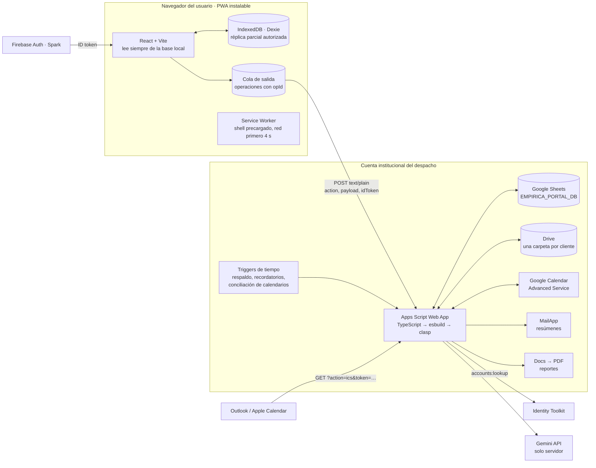
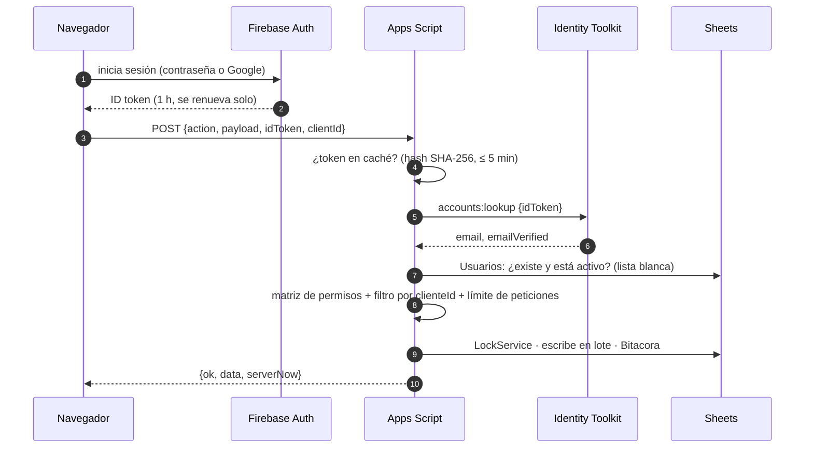
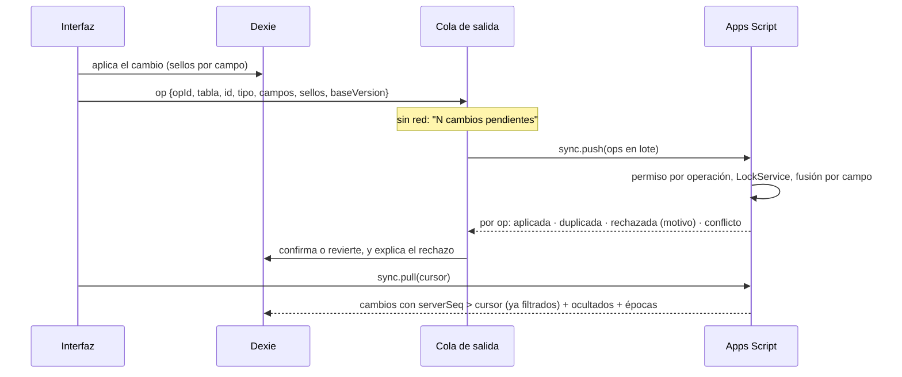

# Plan del proyecto · Empírica Portal

> **Estado: Fase 0 aprobada el 2 de octubre de 2026** (paleta y tipografía A, y respuestas a las 15 preguntas, ver la § 13). **Fase 1 (backend núcleo) en curso.**

Documentos:

| Documento                                    | Contenido                                                                                |
| -------------------------------------------- | ---------------------------------------------------------------------------------------- |
| `PLAN.md` (este)                             | Arquitectura, modelo de datos, sincronización, contrato de la API, riesgos y decisiones  |
| `PERMISOS.md`                                | Matriz completa de permisos por rol                                                      |
| `REUSO_TSJ.md`                               | Técnicas de TSJ Filing que se reutilizan (solo técnicas: ninguna función ni dato de TSJ) |
| `LIMITES.md`                                 | Cuotas y límites verificados el 2 de octubre de 2026, con fuentes                        |
| `SEGURIDAD.md`                               | Modelo de amenazas, controles y la diferencia con el cifrado de TSJ                      |
| `IA.md`                                      | Modos de IA, términos vigentes de Gemini y modelos disponibles                           |
| `DISENO.md` y `design/paleta-propuesta.html` | Paleta, logos, tokens claro/oscuro, semáforo, gráficas, tipografía y ayudas de interfaz  |
| `SETUP.md`                                   | Cuentas y datos que hacen falta, paso a paso                                             |

---

## 1. Decisiones

| #   | Tema                              | Decisión                                                                                                                                                                                                                                                                                                                                                                                         | Por qué                                                                                                                                                                                                                                                                                                        |
| --- | --------------------------------- | ------------------------------------------------------------------------------------------------------------------------------------------------------------------------------------------------------------------------------------------------------------------------------------------------------------------------------------------------------------------------------------------------ | -------------------------------------------------------------------------------------------------------------------------------------------------------------------------------------------------------------------------------------------------------------------------------------------------------------- |
| D1  | Proyecto                          | App aparte (este repo), **sin vínculo con TSJ Filing** y sin funciones de TSJ. De TSJ solo se copian técnicas ya probadas (reloj y fusión de la sincronización, Service Worker, diagnóstico de errores)                                                                                                                                                                                          | Decisión del socio (preguntas 7 y 8)                                                                                                                                                                                                                                                                           |
| D2  | Hosting                           | GitHub Pages con `portal.empirica.mx`; el repo sigue público                                                                                                                                                                                                                                                                                                                                     | Gratis solo con repo público (pregunta 14: sí). El DNS de `empirica.mx` está en GoDaddy (`SETUP.md`, paso 7)                                                                                                                                                                                                   |
| D3  | Autenticación                     | Firebase Auth (Spark): correo y contraseña, y Google. Verificación de correo obligatoria. Altas por invitación enviada desde el portal                                                                                                                                                                                                                                                           | El enlace mágico de Firebase en Spark está limitado a 5 correos al día (`LIMITES.md` § 4)                                                                                                                                                                                                                      |
| D4  | Backend                           | Apps Script en TypeScript, empaquetado con esbuild y desplegado con clasp; Web App que corre como la cuenta propietaria y acepta peticiones anónimas                                                                                                                                                                                                                                             | La identidad la da el ID token de Firebase, que se verifica en cada petición                                                                                                                                                                                                                                   |
| D5  | Base de datos                     | Libro `EMPIRICA_PORTAL_DB` que crea `setup()`                                                                                                                                                                                                                                                                                                                                                    | No hay que crear la hoja a mano                                                                                                                                                                                                                                                                                |
| D6  | Sincronización                    | Incremental por registro (`serverSeq`), cola de salida con `opId`, gana la última edición **por campo**, campos sensibles con aviso de conflicto                                                                                                                                                                                                                                                 | Reglas probadas en TSJ, adaptadas a varios usuarios                                                                                                                                                                                                                                                            |
| D7  | Base local                        | IndexedDB con Dexie: réplica parcial con solo lo autorizado                                                                                                                                                                                                                                                                                                                                      | La interfaz nunca espera al servidor y funciona sin red                                                                                                                                                                                                                                                        |
| D8  | IA                                | Gemini solo desde el servidor; modo `METADATA_ONLY` (pregunta 6)                                                                                                                                                                                                                                                                                                                                 | Los términos del nivel gratuito permiten revisión humana (`IA.md`)                                                                                                                                                                                                                                             |
| D9  | Diseño                            | **Paleta y tipografía A aprobadas** (Cormorant Garamond + Montserrat). Verde y durazno anclados a las tintas oficiales **PANTONE 627 C** y **7514 C** del archivo maestro; logos oficiales en vector                                                                                                                                                                                             | El archivo maestro define la marca con valores exactos; el cambio frente a lo aprobado es apenas perceptible (ΔE OK 0.022). `DISENO.md`                                                                                                                                                                        |
| D10 | Nombres                           | Pestañas y columnas de la hoja con los nombres del modelo del socio (español); funciones, variables y comentarios en inglés                                                                                                                                                                                                                                                                      | Son el vocabulario del despacho y se ven en la hoja                                                                                                                                                                                                                                                            |
| D11 | Herramientas                      | Node 22, npm workspaces, TypeScript 6.0 estricto, ESLint, Prettier, Vitest, Playwright                                                                                                                                                                                                                                                                                                           | `typescript-eslint` aún no soporta TypeScript 7                                                                                                                                                                                                                                                                |
| D12 | Cuenta propietaria                | **Recomendación: una cuenta Google gratuita dedicada al portal** (por ejemplo `portal.empirica@gmail.com`), no la personal (`enlilh@gmail.com`). Workspace no hace falta                                                                                                                                                                                                                         | Sin una cuenta dedicada, los usuarios verían el correo personal (remitente de los correos, pantalla de "Continuar con Google", calendarios compartidos) y la credencial del despliegue automático tendría acceso a todo tu Apps Script personal. Con cuenta dedicada no ven nada de eso. Detalle en la § 3 bis |
| D13 | Clientes con varias unidades      | Un cliente puede tener **unidades de negocio** (y sucursales) en jerarquía. Hay usuarios del **hub** (ven todas las unidades) y usuarios **por unidad** (ven solo la suya); cada unidad tiene su propio inicio y el hub ve el consolidado con el desglose por unidad. Sin límite de usuarios por cliente; cada usuario puede llevar su puesto (encargado de RH, finanzas…) y ve "Mis pendientes" | Pregunta 4 (los dos clientes piloto)                                                                                                                                                                                                                                                                           |
| D14 | Avisos                            | **Resumen diario** a todos (despacho y clientes) con los plazos próximos: 7 y 1 días antes en general; 15, 7, 3 y 1 en fatales; contratos según su aviso previo. Solo se envía si hay algo que reportar                                                                                                                                                                                          | Pregunta 5. Cabe en la cuota gratuita de 100 destinatarios al día con los dos pilotos (§ 12)                                                                                                                                                                                                                   |
| D15 | Aprender a usar el portal         | **Botones "¿Cómo se lee?"** (FYI) en el heatmap y en cada gráfica o indicador complejo: para qué sirve y cómo leerlo, con un ejemplo. **Tour guiado rápido** al primer ingreso (se puede repetir desde Ayuda)                                                                                                                                                                                    | Pedido del socio                                                                                                                                                                                                                                                                                               |
| D16 | Instalar en la pantalla de inicio | El tour y un aviso discreto piden instalar el portal, con instrucciones según el sistema detectado: iPhone/iPad (Safari → Compartir → "Agregar a inicio"), Android (botón "Instalar" del sistema o menú ⋮ → "Instalar app") y computadora (icono de instalar en la barra de direcciones)                                                                                                         | Pedido del socio; además, en iPhone evita que Safari borre los datos locales tras 7 días sin uso                                                                                                                                                                                                               |
| D17 | Despliegue del backend            | **Automático**: cada cambio aprobado en `main` se sube a Apps Script desde GitHub Actions, solo con las pruebas en verde y siempre sobre la misma URL. Requiere un paso único: iniciar sesión de clasp con la cuenta propietaria y guardar esa credencial como secreto de GitHub (`SETUP.md`, paso 8)                                                                                            | Pregunta 15. Más cómodo que correr comandos en cada versión; el secreto queda limitado a la cuenta dedicada (D12)                                                                                                                                                                                              |
| D18 | Tareas del cliente                | Cuando el cliente termina una tarea de su lado, pasa a `EN_REVISION` y el despacho la cierra                                                                                                                                                                                                                                                                                                     | Pregunta 10                                                                                                                                                                                                                                                                                                    |
| D19 | Visibilidad por defecto           | `COMPARTIDO` para asuntos, tareas, trámites, obligaciones y contratos; `INTERNO` para comentarios y documentos del despacho. **Cada registro puede cambiarse**                                                                                                                                                                                                                                   | Pregunta 11                                                                                                                                                                                                                                                                                                    |
| D20 | Sin conexión                      | Un dispositivo que pasa **14 días** sin conectarse pide iniciar sesión otra vez antes de mostrar datos. En los equipos del despacho, al cerrar sesión se puede marcar "mantener en este dispositivo"                                                                                                                                                                                             | Pregunta 9, explicada en la § 13                                                                                                                                                                                                                                                                               |

## 2. Arquitectura



### Flujo de cada petición



## 3. Autenticación, invitaciones y sesión

**Inicio de sesión.** Correo y contraseña, o "Continuar con Google". Ambos los ofrece Firebase sin costo. Google ya trae el correo verificado; con contraseña, Firebase envía la verificación (1,000 al día en Spark).

**Por qué no el enlace mágico de Firebase.** En Spark, Firebase envía como máximo 5 correos de inicio de sesión por enlace al día. Propuesta:

1. **Alta por invitación (Fase 2).** El despacho registra el correo y el rol; el servidor crea la invitación (token aleatorio, guarda solo su hash, vence en 7 días) y la envía **desde la cuenta del despacho** con MailApp. El enlace abre el portal, que pide entrar con Google o crear contraseña. Cuando el correo está verificado y coincide con el invitado, el servidor activa al usuario y su membresía.
2. **Invitaciones de `CLIENTE_ADMIN`** quedan en "pendiente de aprobación" hasta que el despacho las aprueba; entonces se envía el correo. El admin de una unidad solo invita dentro de su unidad (D13).
3. **Enlace de acceso sin contraseña (opcional, a validar en F2).** Firebase permite _generar_ enlaces de inicio de sesión sin enviarlos (20,000 al día en Spark). Si la cuenta del despacho puede generarlos desde Apps Script, el servidor los mandaría con MailApp. Si no resulta viable, se queda en contraseña + Google.

**Verificación en el servidor.** `accounts:lookup` de Identity Toolkit con una **API key de servidor** restringida a esa API (en Script Properties). La key del navegador va restringida por dominio; si fuera la misma, la restricción por dominio bloquearía las llamadas del servidor. El resultado se guarda en CacheService con el hash del token, por el menor de 5 minutos y lo que le quede de vida al token. Sin `emailVerified`, no hay acceso.

**Sesión e inactividad.**

- A los 30 minutos sin interacción (configurable) la app se **bloquea** y pide volver a autenticarse, pero no borra la base local; así un abogado en el juzgado no pierde lo que capturó sin red.
- **Cerrar sesión** borra la base local, salvo que el usuario marque "mantener en este dispositivo" (pensado para equipos del despacho).
- Si un dispositivo pasa más de **N días** sin validar contra el servidor, pide iniciar sesión antes de mostrar datos (pregunta 9).
- Al volver la red, el token se renueva **antes** de vaciar la cola de salida.

## 3 bis. La cuenta propietaria y lo que ven los usuarios

Pediste que los usuarios no tengan acceso a la información de la cuenta y que, para ellos, el portal lo sea todo. Estos son los lugares donde la cuenta de Google propietaria podría asomarse, y cómo se cubren:

| Dónde                                            | Qué vería el usuario                                                        | Cómo se evita                                                                                                                                                                                                              |
| ------------------------------------------------ | --------------------------------------------------------------------------- | -------------------------------------------------------------------------------------------------------------------------------------------------------------------------------------------------------------------------- |
| Correos (invitaciones, resúmenes, recordatorios) | El remitente es la cuenta propietaria                                       | Cuenta dedicada (D12), nombre visible "Empírica Portal" y "responder a" el abogado responsable. Opcional: que el remitente sea `portal@empirica.mx` (alias gratuito si el correo de `empirica.mx` permite enviar por SMTP) |
| "Continuar con Google"                           | La pantalla de Google muestra el nombre de la app y su correo de asistencia | Correo de asistencia = la cuenta dedicada                                                                                                                                                                                  |
| Calendarios                                      | Un calendario compartido por Google muestra quién lo comparte               | Por defecto, feed ICS personal (no revela ninguna cuenta y sirve en Google, Outlook y Apple). Con cuenta dedicada también se puede compartir por Google sin exponer nada personal                                          |
| Hoja de cálculo, Drive y Apps Script             | —                                                                           | Los usuarios nunca reciben acceso: todo pasa por la API                                                                                                                                                                    |
| Dirección del servidor                           | `script.google.com/macros/s/…/exec`                                         | No incluye el correo de la cuenta                                                                                                                                                                                          |

**Cuotas con cuenta gratuita.** Con los dos pilotos (digamos 10 a 15 usuarios en el primero, y en el segundo un hub con 5 a 8 unidades de 2 o 3 usuarios cada una) el resumen diario va a unos 30 a 40 destinatarios al día, por debajo de los 100 que permite la cuenta gratuita. Workspace (de pago) solo haría falta si se rebasa ese tope de forma sostenida; el portal avisa al administrador al 80 %.

## 4. Modelo de datos

### Columnas comunes a todas las pestañas

| Columna                  | Tipo                               | Uso                                                                                                                                             |
| ------------------------ | ---------------------------------- | ----------------------------------------------------------------------------------------------------------------------------------------------- |
| `id`                     | UUID                               | Se genera en el dispositivo al crear: el mismo registro tiene el mismo id en todas partes (no hay duplicados que fusionar, a diferencia de TSJ) |
| `createdAt`, `createdBy` | ISO 8601 con offset, id de usuario | Alta                                                                                                                                            |
| `updatedAt`, `updatedBy` | ISO 8601, id de usuario            | Última edición aplicada                                                                                                                         |
| `version`                | entero                             | Lo incrementa el servidor en cada cambio aplicado                                                                                               |
| `deleted`                | ISO 8601 o vacío                   | Borrado lógico con fecha (lápida)                                                                                                               |
| `serverSeq`              | entero                             | Secuencia global que asigna el servidor; el cursor de la sincronización                                                                         |
| `fieldTimestamps`        | JSON                               | Sello de cada campo, para la fusión por campo                                                                                                   |

Todas las fechas se guardan en ISO 8601 con offset; la zona horaria del proyecto es `America/Cancun`.

### Pestañas

Columnas tal como las definiste. Las **negritas** son añadidos que propongo, con su motivo.

| Pestaña                    | Columnas                                                                                                                                                                                                                                                                                                                                                                                                                                                                                                                                        |
| -------------------------- | ----------------------------------------------------------------------------------------------------------------------------------------------------------------------------------------------------------------------------------------------------------------------------------------------------------------------------------------------------------------------------------------------------------------------------------------------------------------------------------------------------------------------------------------------- |
| **Config**                 | `clave`, `valor`, `publica` (si se manda al navegador). Modelo y modo de IA, días de alerta, pesos del índice de salud, límites (MB por archivo, peticiones por minuto, minutos de inactividad, días sin conexión).                                                                                                                                                                                                                                                                                                                             |
| **Clientes**               | `razonSocial`, `nombreComercial`, `rfc`, `servicio` (`FLT_IGUALA` \| `ASUNTO_PUNTUAL`), `perimetroIguala` (JSON: encargos cubiertos y excluidos), `fechaInicio`, `estado`, `abogadoResponsableId`, `driveFolderId`, `calendarId`, `idioma`, `logoFileId`, **`modoIA`** (sobrescribe el global), **`membershipEpoch`** (sube cuando cambian membresías o alcances: obliga a los dispositivos a resincronizar ese cliente)                                                                                                                        |
| **Entidades**              | `clienteId`, `nombre`, `tipo` (`SOCIEDAD` \| `UNIDAD` \| `SUCURSAL`), `rfc`, `domicilio`, `incluidaEnIguala`, **`parentId`** (entidad padre: una sucursal cuelga de su unidad), **`giro`** (bares, restaurantes, educativo…). Cada unidad tiene su propio inicio y sus propios usuarios (D13)                                                                                                                                                                                                                                                   |
| **Usuarios**               | `email`, `nombre`, `lado` (`EMPIRICA` \| `CLIENTE`), `rolBase`, `estado` (`INVITADO` \| `ACTIVO` \| `INACTIVO`), `idioma`, `prefsNotificacion` (JSON), `icsToken` (se guarda su hash), `ultimoAcceso`, **`firebaseUid`** (se fija en el primer acceso; impide que otra cuenta con el mismo correo se haga pasar por el usuario)                                                                                                                                                                                                                 |
| **Membresias**             | `usuarioId`, `clienteId`, `rol`, `alcance` (JSON opcional: asuntos y entidades; una entidad incluye a sus descendientes; aplica a **cualquier** rol de cliente), **`puesto`** (encargado de RH, finanzas…), **`estado`** (`PENDIENTE_APROBACION` \| `ACTIVA` \| `REVOCADA`). Sin alcance = usuario del hub, ve todas las unidades                                                                                                                                                                                                               |
| **Invitaciones** (nueva)   | `email`, `clienteId`, `rol`, `invitadoPor`, `estado` (`PENDIENTE_APROBACION` \| `ENVIADA` \| `ACEPTADA` \| `VENCIDA` \| `RECHAZADA`), `tokenHash`, `venceEn`, `aprobadoPor`. Separa el flujo de alta de los usuarios activos y deja rastro de quién invitó y quién aprobó.                                                                                                                                                                                                                                                                      |
| **Asuntos**                | `clienteId`, `entidadId`, `titulo`, `area` (las 6 áreas), `estado`, `prioridad`, `responsableId`, `fechaInicio`, `fechaObjetivo`, `dentroIguala`, `visibilidad`, `avance` (calculado)                                                                                                                                                                                                                                                                                                                                                           |
| **Tareas**                 | `clienteId`, `asuntoId`, `titulo`, `descripcion`, `ladoResponsable` (`EMPIRICA` \| `CLIENTE` \| `AMBOS`), `responsableId`, `estado` (`POR_HACER` \| `EN_CURSO` \| `EN_ESPERA_CLIENTE` \| `EN_REVISION` \| `BLOQUEADA` \| `HECHO`), `prioridad`, `fechaLimite`, `esFatal`, `dependeDe`, `checklist` (JSON), `visibilidad`, `calendarEventId`, `enEsperaDesde`, **`entidadId`** (unidad a la que pertenece; por defecto la de su asunto)                                                                                                          |
| **Tramites**               | `clienteId`, `entidadId`, `asuntoId`, `plantillaId`, `autoridad`, `folioExpediente`, `etapaActual`, `historialEtapas` (JSON), `fechaPresentacion`, `proximaActuacion`, `fechaLimite`, `estado`, `visibilidad`                                                                                                                                                                                                                                                                                                                                   |
| **PlantillasTramite**      | `nombre`, `autoridad`, `etapas` (JSON ordenado con duración estimada en días). Semilla marcada "BORRADOR: validar por el despacho".                                                                                                                                                                                                                                                                                                                                                                                                             |
| **Obligaciones**           | `clienteId`, `entidadId`, `categoria` (`CORPORATIVO` \| `FISCAL` \| `LABORAL_SEGURIDAD_SOCIAL` \| `PROPIEDAD_INTELECTUAL` \| `LICENCIAS_REGULATORIO` \| `DATOS_PERSONALES` \| `PLD` \| `OTRO`), `nombre`, `fundamento` (lo captura el despacho), `autoridad`, `recurrencia` (RRULE, RFC 5545), `proximoVencimiento`, `ladoResponsable`, `evidenciaRequerida`, `riesgo` (`ALTO` \| `MEDIO` \| `BAJO`), `estado`, `recorreSiInhabil`, **`visibilidad`** (el modelo original no la tenía; sin ella no se puede ocultar una obligación en análisis) |
| **CumplimientosHistorial** | `obligacionId`, `periodo`, `fechaCumplimiento`, `evidenciaDocId`, `validadoPor`, `notas`, **`clienteId`** y **`entidadId`** (copiados de la obligación para filtrar sin cruzar pestañas), **`estado`** (`EN_REVISION` \| `VALIDADO` \| `RECHAZADO`)                                                                                                                                                                                                                                                                                             |
| **CatalogoObligaciones**   | Plantilla reutilizable: nombres y recurrencias marcados "BORRADOR: validar". `fundamento` vacío. **No se inventan fundamentos ni fechas.**                                                                                                                                                                                                                                                                                                                                                                                                      |
| **Contratos**              | `clienteId`, `entidadId`, `contraparte`, `tipo`, `fechaFirma`, `vigenciaHasta`, `renovacionAutomatica`, `diasAvisoPrevio`, `docId`, `responsableId`, `visibilidad`                                                                                                                                                                                                                                                                                                                                                                              |
| **Documentos**             | `clienteId`, `vinculo` (tipo + id), `nombre`, `driveFileId`, `mimeType`, `version`, `visibilidad`, `subidoPor`, `categoria`, **`tamanoBytes`** (para el tope de "disponible sin conexión"), **`entidadId`**                                                                                                                                                                                                                                                                                                                                     |
| **Solicitudes**            | `clienteId`, `titulo`, `descripcion`, `urgencia`, `area`, `estado` (`RECIBIDA` \| `EN_ANALISIS` \| `DENTRO_IGUALA` \| `FUERA_IGUALA_COTIZADA` \| `ACEPTADA` \| `RECHAZADA` \| `CONVERTIDA`), `asuntoIdGenerado`, **`entidadId`** (qué unidad la pide)                                                                                                                                                                                                                                                                                           |
| **Comentarios**            | `tipoEntidad`, `entidadId`, `autorId`, `texto`, `menciones`, `visibilidad`, **`clienteId`** y **`unidadId`** (copiados del registro comentado, para filtrar sin consultarlo; `entidadId` aquí es el id del registro comentado, como en tu modelo)                                                                                                                                                                                                                                                                                               |
| **Eventos**                | `clienteId`, `origen` (tipo + id), `titulo`, `inicio`, `fin`, `todoElDia`, `calendarEventId`, `syncHash`, `tipo` (`VENCIMIENTO` \| `AUDIENCIA` \| `CITA` \| `REUNION`), **`visibilidad`**, **`entidadId`**                                                                                                                                                                                                                                                                                                                                      |
| **DiasInhabiles**          | `fecha`, `descripcion`, `ambito`                                                                                                                                                                                                                                                                                                                                                                                                                                                                                                                |
| **Notificaciones**         | `usuarioId`, `tipo`, `mensaje`, `link`, `leida`, **`clienteId`**                                                                                                                                                                                                                                                                                                                                                                                                                                                                                |
| **Bitacora**               | `usuarioId`, `accion`, `entidad`, `entidadId`, `antes` (JSON), `despues` (JSON), `userAgent`, **`clienteId`**, **`opId`**                                                                                                                                                                                                                                                                                                                                                                                                                       |
| **Reportes**               | `clienteId`, `periodo`, `docId`, `pdfId`, `enviadoA`, `fecha`                                                                                                                                                                                                                                                                                                                                                                                                                                                                                   |
| **Conflictos** (nueva)     | `clienteId`, `entidad`, `entidadId`, `campo`, `valorVigente`, `valorPropuesto`, `propuestoPor`, `estado` (`PENDIENTE` \| `RESUELTO`), `resueltoPor`, `decision`. Hace falta para guardar el "aviso de conflicto" de los campos sensibles.                                                                                                                                                                                                                                                                                                       |
| **OpsAplicadas** (nueva)   | `opId`, `usuarioId`, `resultado` (JSON), `fecha`. Hace idempotente el reenvío: un dispositivo que vuelve tras días sin red no duplica nada. Se depura pasado el doble de los días máximos sin conexión.                                                                                                                                                                                                                                                                                                                                         |

**Alcance por unidad (D13).** Un usuario con alcance ve los registros de sus unidades (y sus sucursales), los que tiene asignados y los que creó; nada del resto del cliente. Por eso las pestañas con datos de una unidad llevan `entidadId` (en `Comentarios`, `unidadId`, porque ahí `entidadId` ya nombra el registro comentado).

Para ocultar registros que **dejan** de ser visibles (por ejemplo, de `COMPARTIDO` a `INTERNO`), las pestañas con `visibilidad` llevan además **`ocultadoEnSeq`**: el `serverSeq` en que se ocultó. Así el servidor avisa al dispositivo del cliente que lo borre, sin delatar nunca los registros que siempre fueron internos (§ 5).

`setup()` es idempotente: crea el libro y las pestañas si faltan, escribe los encabezados en la fila 1, aplica validaciones de datos y protege los rangos. Si ya existen, solo agrega lo que falte.

**Capa de acceso a datos.** Un repositorio genérico por pestaña que lee con `getValues()` una sola vez por petición, mantiene índices en memoria por `id` y `clienteId`, escribe en lote con `setValues()` y guarda en CacheService una instantánea por cliente que se invalida al escribir. La API es un contrato estable: si un día se migra a Firestore, el frontend no cambia.

**Drive.** `Empírica Portal/Clientes/{clienteId} - {nombre}/` con `Corporativo`, `Contratos`, `Compliance`, `PI`, `Laboral`, `Controversias`, `Reportes` e `Interno` (nunca se comparte). Los usuarios de cliente nunca reciben permisos sobre Drive: todo pasa por la API.

## 5. Local-first y sincronización

### En el dispositivo

- Base Dexie `empirica-portal` con versión de esquema y migraciones (como `DB_VERSION` en TSJ). Tablas: las pestañas que el usuario puede ver, `outbox`, `meta` (cursor, desfase de reloj, última validación) y `archivos` (documentos marcados "disponible sin conexión", con tope de MB).
- La interfaz lee siempre de Dexie con consultas reactivas (`useLiveQuery`): responde al instante.
- Cada cambio se aplica primero en local, con sellos por campo de `ahoraSync()`, y entra a la cola con un `opId` único. Lo pendiente lleva marca de "pendiente" hasta que el servidor lo confirma.

### Operaciones y protocolo



- **Cuándo**: al abrir, al enfocar la ventana, al recuperar la red, cada 60 s con la app visible y con Background Sync donde exista (iOS no lo tiene: ahí sirven los tres primeros, como en TSJ).
- **`sync.pull` barato**: si el cursor del cliente ya es el último `serverSeq` (guardado en CacheService), responde sin abrir la hoja. Responde en páginas (`more: true`).
- **Idempotencia**: `OpsAplicadas` guarda el resultado de cada `opId`; un reenvío devuelve el mismo resultado sin aplicar nada otra vez.
- **Permiso por operación**: si al usuario le quitaron acceso mientras estaba sin red, la operación se rechaza, el cambio se revierte en local y el usuario ve el motivo.
- **Revocaciones**: cada respuesta trae los clientes autorizados; lo de un cliente revocado se borra del dispositivo. Si cambia la `membershipEpoch` de un cliente (nuevo alcance, otro rol), el dispositivo borra ese cliente y lo vuelve a descargar.
- **Registros ocultados**: un registro que pasa a `INTERNO` llega al dispositivo del cliente solo como "bórralo" (id, sin contenido), y solo si fue visible alguna vez (`ocultadoEnSeq > cursor`).

### Conflictos

| Caso                                                                                                         | Regla                                                                                                                                                                                                     |
| ------------------------------------------------------------------------------------------------------------ | --------------------------------------------------------------------------------------------------------------------------------------------------------------------------------------------------------- |
| Campos normales                                                                                              | Gana la edición más reciente **de cada campo** (sello corregido con el reloj del servidor). Empate exacto: desempate determinista por `opId`, para que todos converjan igual.                             |
| Sellos del futuro                                                                                            | Un sello más de 5 minutos por delante de `serverNow` se recorta a `serverNow`: un dispositivo con la hora mal no gana para siempre.                                                                       |
| Borrados                                                                                                     | La lápida gana solo si es posterior a la última edición del registro (regla de TSJ). Si no, el borrado se rechaza y se avisa.                                                                             |
| Campos sensibles: `fechaLimite`, `esFatal`, validación de cumplimiento, `visibilidad`, permisos y membresías | Solo se aplican si el dispositivo partió del valor vigente. Si otro lo cambió entre tanto, se conserva el vigente, se crea un registro en `Conflictos` y se avisa al abogado responsable para que decida. |
| Versión (`baseVersion`)                                                                                      | Si coincide con la vigente, se aplica sin más. Si no, se fusiona por campo con las reglas anteriores; nunca se descarta un cambio en silencio.                                                            |

### Service Worker

Workbox vía `vite-plugin-pwa` (`injectManifest`): precarga del shell (lista generada por Vite), red primero con 4 s de espera y luego la copia guardada, como en TSJ. Las respuestas de la API **nunca** se guardan en el Service Worker. Cuando hay versión nueva aparece "Hay una actualización" y el usuario decide cuándo recargar. Una prueba falla si algún archivo que la app usa no está en la precarga.

### Seguridad del dato local

Réplica parcial (solo lo autorizado), borrado al cerrar sesión salvo "mantener en este dispositivo", reautenticación tras N días sin validar y cifrado en reposo opcional con una clave WebCrypto no exportable. Alcance y límites en `SEGURIDAD.md`.

## 6. Permisos

Matriz completa en `PERMISOS.md`. Resumen: el `SOCIO_ADMIN` ve todo; `ABOGADO` y `ASISTENTE` solo sus clientes asignados (el asistente no borra ni administra usuarios); los usuarios de cliente solo ven lo `COMPARTIDO` de su empresa (el colaborador, además, dentro de su alcance) y solo pueden crear solicitudes, comentarios y documentos, cargar evidencia y mover el estado de las tareas de su lado.

## 7. Contrato de la API

Todo es `POST` al Web App con `Content-Type: text/plain;charset=utf-8` (sin preflight) siguiendo la redirección a `script.googleusercontent.com`. Excepción: el feed ICS es `GET`.

**Petición**

```json
{
  "v": 1,
  "action": "sync.pull",
  "payload": {},
  "idToken": "…",
  "clientId": "uuid-opcional",
  "requestId": "uuid",
  "appVersion": "1.0.0"
}
```

**Respuesta.** Apps Script siempre responde HTTP 200; el resultado viaja en el cuerpo.

```json
{ "ok": true, "data": {}, "serverNow": "2026-10-02T12:00:00.000-05:00", "requestId": "uuid" }
{ "ok": false, "error": { "code": "FORBIDDEN", "message": "…", "details": {} }, "serverNow": "…", "requestId": "uuid" }
```

**Códigos de error**: `UNAUTHENTICATED` (token ausente o inválido), `EMAIL_NOT_VERIFIED`, `NOT_WHITELISTED` ("Solicita acceso a tu abogado de Empírica"), `FORBIDDEN`, `NOT_FOUND` (también para ids de otro cliente), `VALIDATION`, `CONFLICT`, `RATE_LIMITED`, `CLIENT_TOO_OLD` (pide actualizar la app), `QUOTA_EXHAUSTED` (IA o correo), `NOT_IMPLEMENTED`, `INTERNAL`.

**Acciones**

| Acción                                                                | Quién           | Sin red   | Payload → respuesta                                                                               | Fase  |
| --------------------------------------------------------------------- | --------------- | --------- | ------------------------------------------------------------------------------------------------- | ----- |
| `session.bootstrap`                                                   | todos           | —         | `{}` → usuario, membresías, clientes autorizados, configuración pública, versión mínima de la app | F1    |
| `sync.pull`                                                           | todos           | —         | `{ cursor, epochs }` → `{ changes[], hidden[], cursor, more, authorizedClients, epochs }`         | F1    |
| `sync.push`                                                           | todos           | se encola | `{ ops[] }` → `{ results[{ opId, status, row?, reason? }] }`                                      | F1    |
| `invitations.create` / `.approve` / `.accept`                         | según matriz    | no        | invitación → estado                                                                               | F2    |
| `conflicts.resolve`                                                   | despacho        | no        | `{ conflictoId, decision }`                                                                       | F3    |
| `files.upload`                                                        | según matriz    | no¹       | `{ clientId, vinculo, nombre, mimeType, base64, categoria }` → documento                          | F3    |
| `files.download`                                                      | según matriz    | no        | `{ documentoId }` → `{ nombre, mimeType, base64 }`                                                | F3    |
| `calendar.subscribe`                                                  | todos           | no        | `{}` → URL del feed ICS (token nuevo, revocable)                                                  | F5    |
| `GET ?action=ics&token=…`                                             | dueño del token | —         | `text/calendar` solo con lo que ese usuario puede ver                                             | F5    |
| `ai.summarize` / `ai.extract` / `ai.ask` / `ai.classify` / `ai.draft` | según matriz    | no        | propuestas en JSON; nada se crea sin aprobación humana                                            | F6    |
| `reports.generate` / `reports.send`                                   | despacho        | no        | `{ clientId, periodo }` → `{ reporteId, pdfId }`                                                  | F6    |
| `admin.*` (usuarios, membresías, configuración, respaldo, bitácora)   | `SOCIO_ADMIN`   | no        | —                                                                                                 | F1–F7 |

¹ Los metadatos se crean sin red; el archivo se sube cuando vuelve la conexión.

Las altas, ediciones y bajas de asuntos, tareas, trámites, obligaciones, contratos, solicitudes y comentarios **no** tienen endpoints propios: viajan como operaciones de `sync.push`. Así funcionan igual con y sin red. Lo administrativo (usuarios, membresías, configuración) exige conexión.

## 8. Calendarios, notificaciones, IA y reportes

- **Calendarios (F5).** Un Google Calendar por cliente ("Empírica · {Cliente}"), uno maestro y, opcionalmente, uno por abogado. Upsert del evento al guardar algo con fecha (idempotente con `syncHash`). Trigger cada 15 min con `syncToken` para traer lo que se movió en Calendar. Los vencimientos legales y los plazos fatales solo se cambian en el portal (si alguien los mueve en Calendar, se revierte y se avisa); las citas y reuniones sí se pueden mover desde Calendar. Recurrencias RRULE expandidas a 12 meses; `DiasInhabiles` solo si `recorreSiInhabil`. Recordatorios 7 y 1 días antes; plazos fatales 15, 7, 3 y 1. El calendario del cliente se comparte por ACL (rol lector) a sus usuarios con cuenta Google; para Outlook y Apple, el feed ICS personal.
- **Notificaciones (F5).** Campana en la app; **resumen diario a todos** con los plazos próximos (D14), configurable por usuario; recordatorios antes de cada vencimiento y al cliente cuando una tarea lleva X días "en espera del cliente". Siempre en resúmenes, nunca un correo por evento (cuota de 100 destinatarios al día en cuenta gratuita).
- **IA (F6).** Ver `IA.md`.
- **Reportes (F6).** Plantilla de Google Docs con marcadores y el formato institucional (membrete, verde, caja de ASUNTO, tablas con cabecera verde, rótulos en versalitas, firmas y numeración), exportada a PDF en la carpeta `Reportes` del cliente y enviada por correo.

**Índice de salud por cliente.** Fórmula con pesos en `Config` sobre obligaciones vencidas, plazos fatales próximos, tareas vencidas, trámites detenidos y días en espera del cliente; el desglose aparece al pasar el cursor. **Sin ningún medidor de horas**: la iguala se mide por perímetro, y lo que cae fuera se marca "fuera de iguala".

## 9. Diseño visual

Ver `DISENO.md` y la vista previa `design/paleta-propuesta.html`. Resumen: verde institucional `#002e29`, durazno `#e5a386`, salmón `#f4b79f` y rubor `#fbefe7`, extraídos con un script de los archivos de marca; neutros cálidos de papel; modo oscuro "noche" derivado del verde; semáforo con icono y texto; 8 colores de gráfica validados para daltonismo; 92 de 92 combinaciones cumplen WCAG 2.2 AA.

## 10. Estructura del repositorio y calidad

```
/
├── apps/web/            React + Vite + Tailwind (F0: página de comprobación)
├── apps/api/            Apps Script en TypeScript → build/Code.js (F0: doGet/doPost de prueba)
├── packages/shared/     Tokens de marca, color y contraste (F0); tipos, zod, permisos y contrato (F1)
├── brand/               Logos, membrete y palette.json extraída
├── scripts/brand/       Extracción de la paleta y generación de tokens
├── docs/                Este plan y sus anexos
└── .github/workflows/   CI con candado de publicación
```

Ya funciona: `npm run check` (formato, lint, tipos y 122 pruebas: matemática de color, las 92 combinaciones de contraste en ambos temas, la validación de la paleta de gráficas, que el CSS generado coincida con los tokens, la página de prueba y el `Code.js` empaquetado ejecutado en un sandbox) y `npm run build`.

Por fase se agregan: modo mock con MSW y datos 100 % ficticios ("Cliente Demo, S.A. de C.V."); suites de aislamiento, visibilidad y roles; las pruebas portadas de TSJ (`test_sync_conflictos`, `test_sync_errores`, `test_offline`); y la prueba de Playwright con dos navegadores y dos usuarios (cortar la red, editar en ambos, recargar, reconectar y comprobar que convergen sin perder cambios y sin que llegue nada `INTERNO` al cliente). El despliegue solo corre con todo en verde, incluidas las pruebas de navegador.

## 11. Fases

| Fase | Contenido                                                                                                                                                                                                                                                                                                                                                            | Hecho cuando                                                                                      | Estado                    |
| ---- | -------------------------------------------------------------------------------------------------------------------------------------------------------------------------------------------------------------------------------------------------------------------------------------------------------------------------------------------------------------------- | ------------------------------------------------------------------------------------------------- | ------------------------- |
| F0   | Plan, preguntas, andamiaje, `CLAUDE.md`, tokens desde `/brand`                                                                                                                                                                                                                                                                                                       | Apruebas el plan y la paleta                                                                      | **Aprobada** (2026-10-02) |
| F1   | `setup()`, capa de datos, verificación del token, lista blanca, permisos (incluido el alcance por unidad), bitácora, contrato, `sync.pull`/`sync.push`, respaldos y despliegue automático                                                                                                                                                                            | Aislamiento y visibilidad en verde, también sobre la sincronización                               | **En curso**              |
| F2   | Login e invitaciones, layout, navegación, i18n ES/EN, temas, selector de cliente y de unidad, modo mock, Dexie, cola, motor de sincronización, Service Worker, indicador de estado, **tour guiado con instrucciones para instalar según iOS, Android o computadora**, componente de ayuda "¿Cómo se lee?", Centro de control e Inicio del cliente (hub y por unidad) | Ambos lados navegables; sin red se crea y edita, y todo converge en dos dispositivos              | Pendiente                 |
| F3   | Tareas, Asuntos, Comentarios, Documentos                                                                                                                                                                                                                                                                                                                             | CRUD completo con roles y visibilidad                                                             | Pendiente                 |
| F4   | Trámites, Compliance (con su heatmap y su botón "¿Cómo se lee?"), Contratos, Solicitudes                                                                                                                                                                                                                                                                             | Matriz de compliance y pipeline de trámites                                                       | Pendiente                 |
| F5   | Calendarios (bidireccional, ACL, ICS) y correos                                                                                                                                                                                                                                                                                                                      | Un vencimiento del portal aparece en Calendar y en el ICS; las citas movidas en Calendar regresan | Pendiente                 |
| F6   | IA y reportes mensuales                                                                                                                                                                                                                                                                                                                                              | Reporte PDF de prueba con formato institucional                                                   | Pendiente                 |
| F7   | Rendimiento, auditoría sin conexión (incluido iOS), accesibilidad, seguridad, despliegue en `portal.empirica.mx`, documentación                                                                                                                                                                                                                                      | Checklist de seguridad aprobado y producción                                                      | Pendiente                 |

## 12. Riesgos

| Riesgo                                                                                                                                                                                               | Impacto                                             | Mitigación                                                                                                                     |
| ---------------------------------------------------------------------------------------------------------------------------------------------------------------------------------------------------- | --------------------------------------------------- | ------------------------------------------------------------------------------------------------------------------------------ |
| Todo el portal comparte 30 ejecuciones simultáneas (corre como la cuenta del despacho)                                                                                                               | Picos de uso lentos                                 | Local-first, atajo de `sync.pull`, lotes; con decenas de usuarios el promedio queda muy por debajo                             |
| Cuenta gratuita en lugar de Workspace                                                                                                                                                                | 100 destinatarios y 90 min de triggers al día       | Resúmenes, triggers consolidados, contador con aviso (pregunta 1)                                                              |
| Sheets no tiene transacciones entre pestañas                                                                                                                                                         | Escritura a medias si algo falla a mitad            | Validar todo antes de escribir, un solo candado por lote, `OpsAplicadas` y `Bitacora` para reconstruir                         |
| Gemini gratuito: ~20 peticiones al día en Flash y datos usables por Google                                                                                                                           | IA escasa y riesgo de confidencialidad              | Flash-Lite por defecto, `METADATA_ONLY`, contador y degradación; `FULL` solo con key de pago                                   |
| Safari borra datos tras 7 días sin uso                                                                                                                                                               | Un iPhone pierde la réplica (y una cola sin enviar) | Recomendar instalar el portal en la pantalla de inicio; vaciar la cola en cuanto hay red; el servidor es la fuente de verdad   |
| Dispositivo perdido con datos locales                                                                                                                                                                | Exposición de lo descargado                         | Réplica parcial, bloqueo por inactividad, reautenticación tras N días, cifrado opcional, borrado al revocar                    |
| La URL del Web App cambia con cada despliegue nuevo                                                                                                                                                  | La app deja de encontrar el servidor                | Desplegar siempre sobre el mismo `deploymentId` (`clasp redeploy`)                                                             |
| La API key de Firebase es pública                                                                                                                                                                    | Abuso del proyecto                                  | Restricción por dominio y por API; key de servidor aparte; la lista blanca impide el acceso a datos aunque alguien cree cuenta |
| El repositorio es público                                                                                                                                                                            | El código se ve                                     | No hay secretos en el repo (Script Properties); la seguridad no depende de esconder el código                                  |
| Ediciones simultáneas de plazos fatales                                                                                                                                                              | Un plazo mal puesto                                 | Campos sensibles sin resolución automática: aviso de conflicto al abogado                                                      |
| "Continuar con Google" con el portal fuera de Firebase Hosting, sobre todo en iPhone con la app instalada (los navegadores bloquean el almacenamiento de terceros que usa el inicio por redirección) | Ese botón falla en algunos dispositivos             | Usar la ventana emergente de Firebase y probarlo en iOS en la Fase 2; correo y contraseña siempre funcionan como alternativa   |

## 13. Respuestas del socio (2 de octubre de 2026) y pendientes

| #   | Pregunta                | Respuesta                                                                                                                                                   | Queda en el plan como                                                                                           |
| --- | ----------------------- | ----------------------------------------------------------------------------------------------------------------------------------------------------------- | --------------------------------------------------------------------------------------------------------------- |
| 1   | Cuenta propietaria      | `enlilh@gmail.com`, sin Workspace (dispuesto a activarlo); que los usuarios no tengan acceso a esa información                                              | D12 y § 3 bis: **recomiendo una cuenta gratuita dedicada**; Workspace no hace falta. **Pendiente: tu decisión** |
| 2   | Dominio                 | `empirica.mx`, administrado en GoDaddy                                                                                                                      | `portal.empirica.mx`; registro CNAME en `SETUP.md`, paso 7                                                      |
| 3   | Usuarios del despacho   | Dos socios titulares                                                                                                                                        | Ambos `SOCIO_ADMIN`. Sus correos van en Script Properties (`ADMIN_EMAILS`), no en el repositorio                |
| 4   | Clientes piloto         | Uno con muchos encargados de área; un corporativo con unidades de negocio (bares, restaurantes, educativos…) que quiere un hub general y cuentas por unidad | D13. En el repositorio solo hay datos ficticios: los nombres reales se capturan en producción                   |
| 5   | Resúmenes y alertas     | Diarios, con plazos                                                                                                                                         | D14                                                                                                             |
| 6   | Modo de IA              | `METADATA_ONLY`                                                                                                                                             | D8                                                                                                              |
| 7   | ¿App aparte?            | Aparte; nada de TSJ                                                                                                                                         | D1                                                                                                              |
| 8   | Vínculo con TSJ         | Ninguno                                                                                                                                                     | D1                                                                                                              |
| 9   | Sin conexión            | No quedó clara la pregunta                                                                                                                                  | Explicada abajo; se adopta lo propuesto (D20), ajustable después en Configuración                               |
| 10  | Tareas del cliente      | `EN_REVISION`                                                                                                                                               | D18                                                                                                             |
| 11  | Visibilidad por defecto | La propuesta, con opción de cambiarla                                                                                                                       | D19                                                                                                             |
| 12  | Aviso de privacidad     | Será una liga                                                                                                                                               | **Pendiente: la URL**                                                                                           |
| 13  | Paleta y tipografía     | Aprobadas, tipografía A; mandaste el archivo maestro en vector                                                                                              | D9                                                                                                              |
| 14  | Repo público            | Sí                                                                                                                                                          | D2                                                                                                              |
| 15  | Despliegue del backend  | Automatizado o por comandos, a mi criterio                                                                                                                  | D17: automatizado                                                                                               |

**La pregunta 9, en simple.** El portal guarda en cada dispositivo una copia de lo que el usuario puede ver, para funcionar sin internet (por ejemplo, en el celular sin señal). Si ese dispositivo se pierde, esa copia es lo que podría quedar expuesto. Por eso:

- si un dispositivo pasa **14 días** sin conectarse con el servidor, antes de mostrar datos pide iniciar sesión otra vez;
- al **cerrar sesión**, la copia se borra; en las computadoras del despacho se puede marcar "mantener en este dispositivo" para seguir trabajando sin red.

Ambos valores se pueden cambiar después en Configuración.

**Pendientes para producción** (no bloquean la Fase 1):

1. Decidir la cuenta propietaria (D12) y, con ella, crear Firebase, Apps Script y la key de Gemini (`SETUP.md`).
2. La URL del aviso de privacidad.
3. El registro DNS en GoDaddy cuando publiquemos (`SETUP.md`, paso 7).
